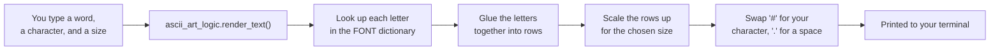
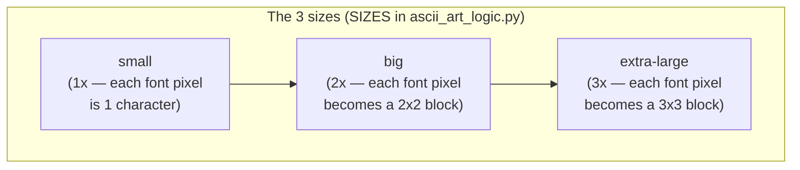

# ASCIIPrint

A small Python program, designed as a first project for students who are
brand new to Python, that turns a word or name into big letters made out
of a character *you* choose — the same idea as those old "block letter"
banners, but printed straight in your terminal. It's built around four
core ideas: **strings, lists, dictionaries, loops, and conditionals**
(yes, that's five — this project leans on them harder than most!),
working together in one program you can actually play with.

For a deep dive into *how* it's built (with diagrams), read
[`SPEC.md`](./SPEC.md). This file just gets you running.

```
$ python3 asciiprint.py "HI" --char "#" --size big
##      ##  ##########
##      ##  ##########
##      ##      ##
##      ##      ##
##      ##      ##
##      ##      ##
##########      ##
##########      ##
##      ##      ##
##      ##      ##
##      ##      ##
##      ##      ##
##      ##  ##########
##      ##  ##########
```

## How it works, in one picture



## Getting started (never used Python before? Start here)

Three steps: install Python, download this project, run the program. If
you've done this before, skip to [Step 3](#step-3--run-the-program).

> **A note on `python` vs `python3`:** on Windows the command is usually
> `python`; on macOS and Linux it's usually `python3`. Wherever you see
> `python3` below, Windows users should type `python` instead. If one
> doesn't work, try the other — that's the single most common hiccup.

### Step 1 — Install Python 3.11 or later

First check whether you already have it. Open a terminal
(**Windows:** press Start, type `cmd`, hit Enter · **macOS:** press
`Cmd+Space`, type `terminal`, hit Enter · **Linux:** `Ctrl+Alt+T`) and
run:

```bash
python3 --version
```

If that prints `Python 3.11.0` or higher, you're done — skip to Step 2.
If it prints an older version, or says the command isn't found, install
Python:

**Windows**
1. Go to <https://www.python.org/downloads/> and click the big download
   button.
2. Run the installer, and — this part matters — **tick the box that says
   "Add python.exe to PATH"** at the bottom of the first screen *before*
   clicking Install Now. If you forget, the `python` command won't work
   in your terminal.
3. Close and reopen your terminal, then check with `python --version`.

**macOS**
1. Go to <https://www.python.org/downloads/> and download the macOS
   installer, then run it and click through.
2. Close and reopen Terminal, then check with `python3 --version`.

(If you already use Homebrew, `brew install python3` works too.)

**Linux (Ubuntu / Debian)**

```bash
sudo apt-get install python3
```

ASCIIPrint has **no other dependencies** — no `pip install` needed, no
graphics libraries, nothing beyond Python itself. It doesn't even open a
window; it just prints text.

### Step 2 — Download the project from GitHub

Pick **one** of these two options.

**Option A — Download a ZIP (easiest, no extra tools)**

1. Open
   <https://github.com/olumuyiwaoluwasanmi-codepath/Comp163Projects> in
   your browser.
2. Click the green **Code** button, then **Download ZIP**.
3. Unzip the downloaded file somewhere you'll remember, like your
   Desktop.

**Option B — Clone it with Git (what most programmers do)**

This keeps your copy easy to update later with `git pull`. If you don't
have Git, get it from <https://git-scm.com/downloads> first, then run:

```bash
git clone https://github.com/olumuyiwaoluwasanmi-codepath/Comp163Projects.git
```

That creates a folder named `Comp163Projects` in whatever directory your
terminal is currently in.

### Step 3 — Run the program

In your terminal, move into the project folder and start it. `cd` means
"change directory":

```bash
cd Comp163Projects/asciiprint
python3 asciiprint.py
```

The program will ask you three questions — one at a time:

1. **What word or short phrase should I print?** — e.g. your name.
2. **Which character should draw it?** — any single character, like `#`,
   `@`, `*`, or even an emoji. Press Enter to use `*`.
3. **Choose a size** — `small`, `big`, or `extra-large`. Press Enter to
   use `big`.

Then your word appears on screen, built out of that character!

> **If you downloaded the ZIP**, your folder may be named
> `Comp163Projects-main` or similar — use that name in the `cd` command
> instead. Tip: on Windows and macOS you can type `cd ` (with a space)
> and then drag the folder from your file manager onto the terminal
> window to fill in the path for you.

### Skipping the questions

If you already know what you want, you can pass it all on the command
line instead of answering the prompts:

```bash
python3 asciiprint.py "CODEPATH" --char "$" --size extra-large
```

Any of `text`, `--char`, or `--size` can be left out — you'll just be
asked for whichever ones you skipped. Run `python3 asciiprint.py --help`
to see every option.

### If something goes wrong

| What you see | What it means |
|---|---|
| `python3: command not found` | Python isn't installed, or wasn't added to PATH. Redo Step 1 — on Windows, watch for that PATH checkbox. Try `python` instead of `python3`. |
| `can't open file 'asciiprint.py'` | You're in the wrong folder. Run `cd asciiprint` first; `ls` (macOS/Linux) or `dir` (Windows) should list `asciiprint.py`. |
| `Oops, I can't print that: fill_char must be exactly one character` | You typed more than one character (or pasted extra text) when asked for the drawing character. Try again with just one. |
| The letters look squished or wrap oddly | Your terminal window is too narrow for the size you picked — a long word at `extra-large` can be well over 100 characters wide. Make the window wider, use a shorter word, or pick `small`. |

## Project files

| File | What's in it |
|---|---|
| `ascii_art_logic.py` | All the **font data and rules** — the letter patterns, and the functions that turn text into rows of characters. No `input()`, no `print()`. |
| `asciiprint.py` | The **interactive program** — asks you questions, then hands your answers to `ascii_art_logic.py` and prints the result. |
| `test_ascii_art_logic.py` | 30 automated tests (including regression tests) for `ascii_art_logic.py`. |
| `test_asciiprint.py` | 23 automated tests for `asciiprint.py` — the prompts, the command-line flags, and `main()` end-to-end — using `unittest.mock.patch` to fake typed answers. |
| `SPEC.md` | A guided tour of the design, with diagrams. |

Splitting the *font/rendering rules* from the *interactive program* is
the same idea used throughout this repo — see
[`SPEC.md`](./SPEC.md#2-file-layout) for why.

## Choosing a character and a size

Any single character works as the drawing character — letters, digits,
symbols, even a single emoji. Just not a blank space (the letters would
be invisible!) and not more than one character.



## Supported characters

The built-in font (`FONT` in `ascii_art_logic.py`) covers:

* Uppercase and lowercase letters `A`–`Z` (lowercase is automatically
  converted to uppercase before drawing)
* Digits `0`–`9`
* A blank space, for multi-word phrases
* Basic punctuation: `! ? . , ' -`

Any other character (an accented letter, an emoji, a typo) is drawn as a
`?` block instead of crashing the program — try
`python3 asciiprint.py "Hi @"` and see for yourself.

## Running the tests

`ascii_art_logic.py` has zero dependency on `input()`/`print()`, so its
tests run instantly. `asciiprint.py` *does* call `input()` and `print()`,
but its tests never wait for a real person to type anything — they use
`unittest.mock.patch` to feed in canned answers and capture what would
have been printed, so they run instantly too. Run everything with:

```bash
cd asciiprint
python3 -m unittest discover -p "test_*.py" -v
```

or run one file at a time:

```bash
python3 -m unittest test_ascii_art_logic.py -v
python3 -m unittest test_asciiprint.py -v
```

You should see all 53 tests pass (30 + 23). They're organized into
groups — including a `RegressionTests` group in
`test_ascii_art_logic.py` that locks in the *exact* expected output for
a few words, so an accidental change to the font or the scaling math
gets caught immediately, even if it doesn't break any of the more
general tests; and a `MainEndToEndTests` group in `test_asciiprint.py`
that runs the whole program from command-line flags (or from faked
prompt answers) all the way to the printed banner. If you change a
letter's shape in `FONT`, tweak `scale_grid()`, or change how a prompt
validates its answer, run the tests again and see what (if anything)
breaks — that's the whole point of having them!

## Type checking (optional)

Every function in this project declares the types of what it takes in
and what it gives back, and `ascii_art_logic.py` goes a step further
with **named type aliases** (`Row`, `Glyph`, `Grid`) so a signature like
`build_base_grid(text: str) -> Grid` reads as English instead of a wall
of `list[str]`. Python doesn't check any of these declarations when it
runs — they're there for you and your editor — but you can have a tool
check them for you:

```bash
pip install mypy
mypy --strict ascii_art_logic.py asciiprint.py test_ascii_art_logic.py test_asciiprint.py
```

All four files pass `--strict` with no errors.

## Where each concept lives

This is a quick index. [`SPEC.md`](./SPEC.md#9-concept-map-with-fileline-references)
has the full table with exact file/line references and more context —
this is just enough to get you started reading the code with a purpose.

* **Strings** — every glyph row (like `"#...#"`) is a string; so is the
  word you type in.
* **Lists** — `FONT["A"]` is a list of 7 row-strings; the rendered output
  is a list of lines ready to print.
* **Dictionaries** — `FONT` maps a character to its pattern; `SIZES`
  maps a size name to its scale-up multiplier.
* **Loops** — `build_base_grid()` loops over every character in your
  text; `scale_grid()` loops over every row to stretch it.
* **Conditionals** — `render_text()` checks your inputs are usable
  before drawing anything; `get_glyph()` falls back to `?` for unknown
  characters.

Every `[TAG]` comment inside `ascii_art_logic.py` and `asciiprint.py`
marks one of these ideas in the exact spot it's being used — search the
files for `[LOOP]`, `[CONDITIONAL]`, `[STRING]`, `[LIST]`, and
`[DICTIONARY]` to find every occurrence.

## Stretch goals

Once you're comfortable reading the code, here are some good next
projects, roughly in order of difficulty:

1. **Add a 4th size**, like `"tiny"` at a fractional scale, or a huge
   `"banner"` size at 5x. (Dictionaries — just add an entry to `SIZES`.)
2. **Add more punctuation** to `FONT`, like `:` `;` `(` `)` `/`. Draw the
   5x7 pattern on paper first, then translate it into `#`/`.` rows.
   (Dictionaries, strings)
3. **Add a `--color` option** using
   [ANSI escape codes](https://en.wikipedia.org/wiki/ANSI_escape_code#Colors)
   so the letters print in color in terminals that support it.
   (Strings, conditionals)
4. **Save the output to a text file** instead of (or in addition to)
   printing it, using Python's built-in `open()`. (File I/O)
5. **Support a two-character fill pattern**, like alternating `#` and
   `*`, instead of just one repeated character. You'll need to rework
   `render_text()`'s substitution step. (Loops, strings)
6. **Center multi-line phrases** by splitting on `\n` and rendering each
   line separately, then joining them back together with blank lines
   between. (Strings, lists, loops)

Have fun, and don't be afraid to break it — `test_ascii_art_logic.py`
will tell you exactly what you broke.
