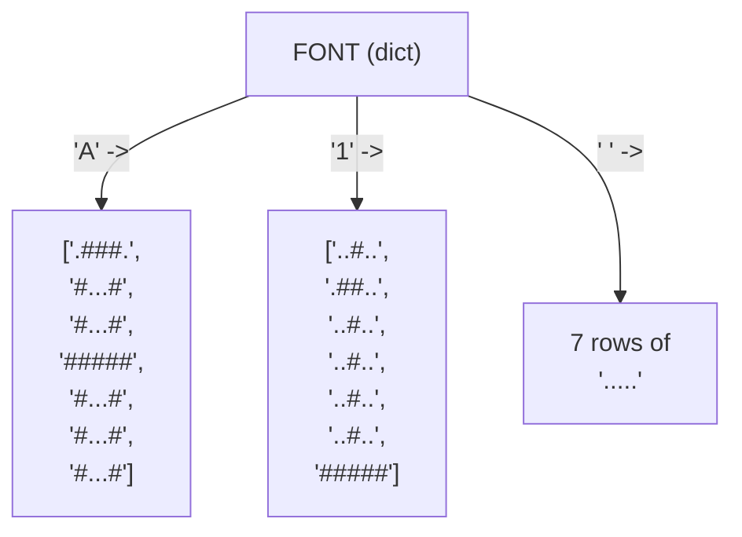
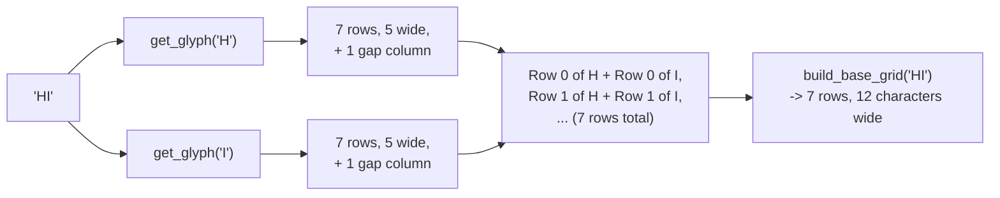
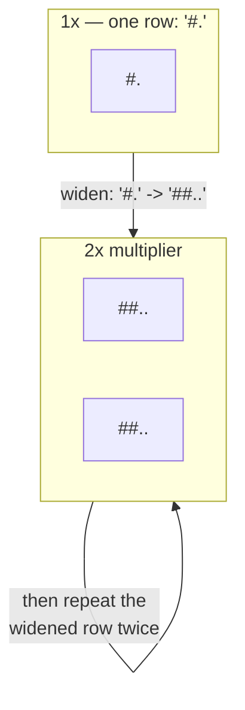
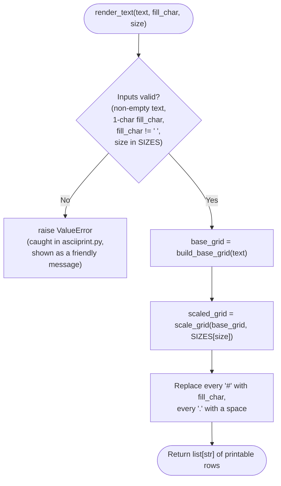

# ASCIIPrint — Design Spec

This document explains **how** and **why** ASCIIPrint is built the way it
is. Read [`README.md`](./README.md) first if you just want to run the
program — come here when you want to understand the design well enough to
extend it yourself.

Every diagram below is [Mermaid](https://mermaid.js.org/) — GitHub, most
IDEs, and the Mermaid Live Editor (<https://mermaid.live>) will render it
as a picture automatically.

---

## 1. Learning goals

This project exists to give you real (not toy) practice with five core
Python building blocks, inside a program small enough to hold in your
head:

| Concept | Where it does real work in this project |
|---|---|
| **Strings** | Every glyph row, like `"#...#"`, is a string; the word you type is a string too |
| **Lists** | `FONT["A"]` is a list of 7 row-strings; the finished output is a list of printable lines |
| **Dictionaries** | `FONT` maps a character to its shape; `SIZES` maps a size name to a scale-up number |
| **Loops** | Walking across every character in the input, and every row of every glyph |
| **Conditionals** | Validating the user's inputs, and falling back to `?` for characters the font doesn't know |

Section 8 below (the concept map) gives exact file/line references.

---

## 2. File layout

```
asciiprint/
├── ascii_art_logic.py       # Pure font data and rendering rules — no input()/print()
├── asciiprint.py             # Interactive program: asks questions, prints the result
├── test_ascii_art_logic.py   # Automated tests (including regression tests) for the logic
├── test_asciiprint.py        # Automated tests for the interactive program itself
├── README.md                  # Quickstart, controls, concept index
└── SPEC.md                    # This file
```

The most important design decision in the whole project is drawn below:
**the font/rendering rules and the interactive program are two separate
files**, exactly like `tetris_logic.py` and `tetris.py` in the sibling
`turtle_tetris` project.


Because `ascii_art_logic.py` never calls `input()` or `print()`, its
tests (`test_ascii_art_logic.py`) can call `render_text()` directly and
check the exact strings it returns — no simulated typing required, and
no window to close when a test hangs.

---

## 3. The font: a dictionary of lists of strings

`FONT` is the heart of the project. Every key is a single character
(`"A"`, `"7"`, `"!"`, `" "`, ...), and every value is a **list of 7
strings**, each 5 characters wide — a tiny 5x7 grid, the same idea used
by real dot-matrix signs.

Three small **type aliases**, defined at the top of `ascii_art_logic.py`,
name these shapes so function signatures read as English:

```python
Row: TypeAlias = str            # one printable row, e.g. "#...#" or "*   *"
Glyph: TypeAlias = list[Row]    # one character's pattern: GLYPH_HEIGHT rows
Grid: TypeAlias = list[Row]     # a whole rendered word: also a list of rows
```

So `FONT` is typed as `dict[str, Glyph]`, and `render_text()` returns a
`Grid` — which mypy checks is really `list[str]` under the hood, but a
reader instantly knows *what kind* of list of strings it is, the same
way `turtle_tetris`'s `type Board = list[list[Cell]]` names its shape.



`"#"` means "this pixel is part of the letter"; `"."` means "leave it
blank." Printing `FONT["A"]` one row at a time already draws a
recognizable letter A:

```
.###.
#...#
#...#
#####
#...#
#...#
#...#
```

`GLYPH_HEIGHT` (7) and `GLYPH_WIDTH` (5) are just those two numbers given
names, so the rest of the code never has a magic `7` or `5` floating
around unexplained.

---

## 4. `get_glyph()`: looking a character up safely

```python
def get_glyph(character: str) -> Glyph:
    return FONT.get(character.upper(), UNKNOWN_GLYPH)
```

Two small design choices matter here:

* **`.upper()` first** — the font only stores capital letters, so typing
  a name in lowercase (`"maria"`) still works.
* **`.get(..., UNKNOWN_GLYPH)` instead of `FONT[...]`** — if the
  character isn't in the dictionary at all (an emoji, an accented
  letter, a stray symbol), a plain `FONT["@"]` lookup would crash the
  whole program with a `KeyError`. `.get()` with a default value is a
  dictionary's built-in fallback, so an unsupported character just draws
  as a `?` glyph instead of stopping the show.

---

## 5. From a word to a grid: `build_base_grid()`

This function takes a whole string (like `"HI"`) and produces the 7 rows
of the *actual size* (1x) picture, with every letter's glyph glued onto
the row, plus one blank `.` column after each letter as a gap.



The trick is the **outer loop is over characters, the inner loop is over
rows** — for every character, all 7 of its rows get appended to the
matching row of the result, not to 7 brand-new rows. That's why `rows` is
created once, up front, as `["" for _ in range(GLYPH_HEIGHT)]`, and then
built up in place.

---

## 6. From a grid to a size: `scale_grid()`

`SIZES` maps each size name to a multiplier:

| Size name | Multiplier |
|---|---|
| `"small"` | 1 |
| `"big"` | 2 |
| `"extra-large"` | 3 |

`scale_grid()` turns a 1x grid into an *N*x grid two ways at once: every
**character** in a row is repeated `N` times (making it wider), and every
**whole row** is then repeated `N` times in the output (making it
taller) — so a single "#" pixel becomes a solid `N` x `N` square instead
of a stretched rectangle.



```python
def scale_grid(rows: list[str], multiplier: int) -> list[str]:
    scaled_rows: list[str] = []
    for row in rows:
        wide_row = "".join(character * multiplier for character in row)
        for _ in range(multiplier):
            scaled_rows.append(wide_row)
    return scaled_rows
```

---

## 7. Putting it together: `render_text()`

`render_text(text, fill_char, size)` is the single function
`asciiprint.py` calls. It does three things, in order:



Validation happens **first**, before any font lookups, so a bad input
(like a size that doesn't exist) never gets partway through building a
grid before failing — it fails fast, with a clear message, right at the
door. This mirrors how real programs are built: check your inputs at the
boundary, then trust them completely for the rest of the function.

---

## 8. Concept map (with file:line references)

| Concept | Where | What to look at |
|---|---|---|
| **Strings** | `ascii_art_logic.py:61-451` | Every glyph row in `FONT`, e.g. `"#...#"` |
| **Strings** | `ascii_art_logic.py:467` | `character.upper()` |
| **Lists** | `ascii_art_logic.py:44-48` | `SIZES` values are plain ints, but every `FONT` entry is a list |
| **Lists** | `ascii_art_logic.py:477` | `rows = ["" for _ in range(GLYPH_HEIGHT)]` |
| **Dictionaries** | `ascii_art_logic.py:44-48` | `SIZES` |
| **Dictionaries** | `ascii_art_logic.py:61-451` | `FONT` |
| **Dictionaries** | `ascii_art_logic.py:467` | `FONT.get(...)` — a dictionary lookup with a default |
| **Loops** | `ascii_art_logic.py:478-482` | `build_base_grid()`'s two nested `for` loops |
| **Loops** | `ascii_art_logic.py:493-496` | `scale_grid()`'s two `for` loops |
| **Loops** | `asciiprint.py` | Every `while True:` prompt loop (`ask_word`, `ask_char`, `ask_size`), plus the `for line in lines:` print loop in `main()` |
| **Conditionals** | `ascii_art_logic.py:510-518` | `render_text()`'s input validation |
| **Conditionals** | `ascii_art_logic.py:467` | The fallback built into `.get(..., UNKNOWN_GLYPH)` |
| **Conditionals** | `asciiprint.py` | Every prompt loop's `if raw == "": ...` / `if raw.isdigit(): ...` checks |
| **Type hints & aliases** | `ascii_art_logic.py:20-38` | The `Row` / `Glyph` / `Grid` `TypeAlias` definitions |
| **Type hints & aliases** | Every function signature in `ascii_art_logic.py` and `asciiprint.py` | Every parameter and return value is annotated; verified with `mypy --strict` |

Every `[TAG]` comment inside `ascii_art_logic.py` and `asciiprint.py`
marks one of these ideas in the exact spot it's being used — search for
`[LOOP]`, `[CONDITIONAL]`, `[STRING]`, `[LIST]`, and `[DICTIONARY]` to
find every occurrence yourself; line numbers shift as the file changes,
so the tags are the reliable way to find them.

---

## 9. Where to go next

* Read [`README.md`](./README.md#stretch-goals) for a list of stretch
  goals, roughly ordered by difficulty.
* Run the tests (`python3 -m unittest discover -p "test_*.py" -v`) and
  read through `test_ascii_art_logic.py` — the test class names
  (`FontDataTests`, `GetGlyphTests`, `BuildBaseGridTests`,
  `ScaleGridTests`, `RenderTextTests`, `RegressionTests`) double as a
  second, executable description of every rule in this document.
* Read `test_asciiprint.py` too — `AskWordTests`, `AskCharTests`, and
  `AskSizeTests` cover every prompt-loop branch, `BuildParserTests`
  covers the `--char`/`--size` command-line flags, and
  `MainEndToEndTests` runs the whole program start to finish (using
  `unittest.mock.patch` to fake typed answers) and checks the exact
  banner it prints.
* Try breaking something on purpose — change a glyph in `FONT`, the gap
  width in `build_base_grid()`, or a validation check in `ask_char()` —
  and watch which tests catch it.
