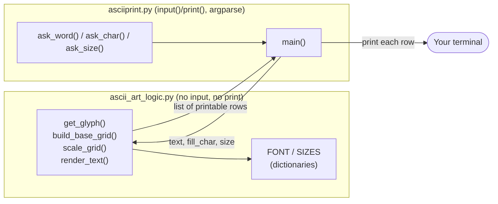
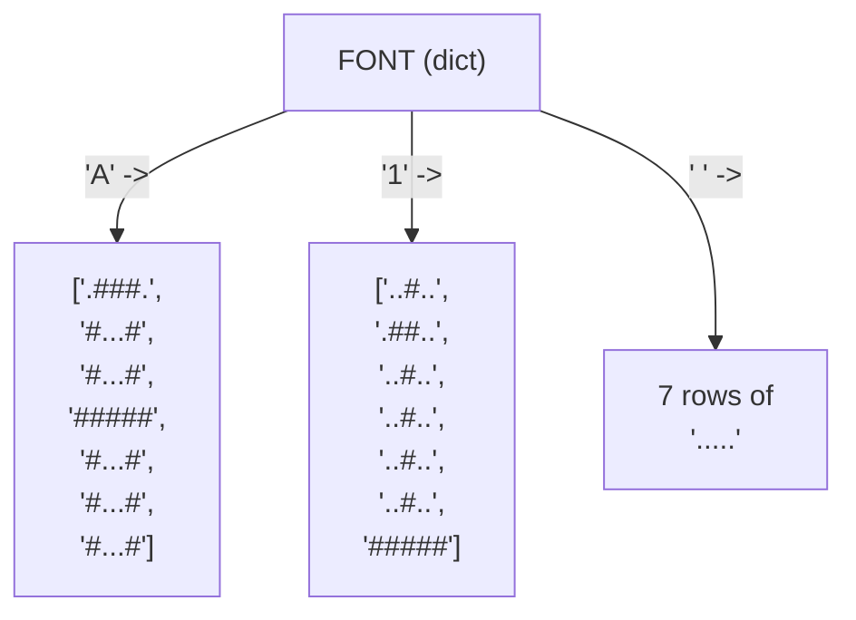
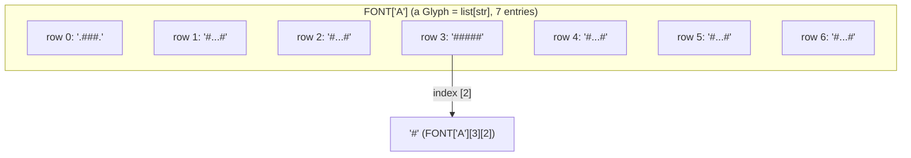
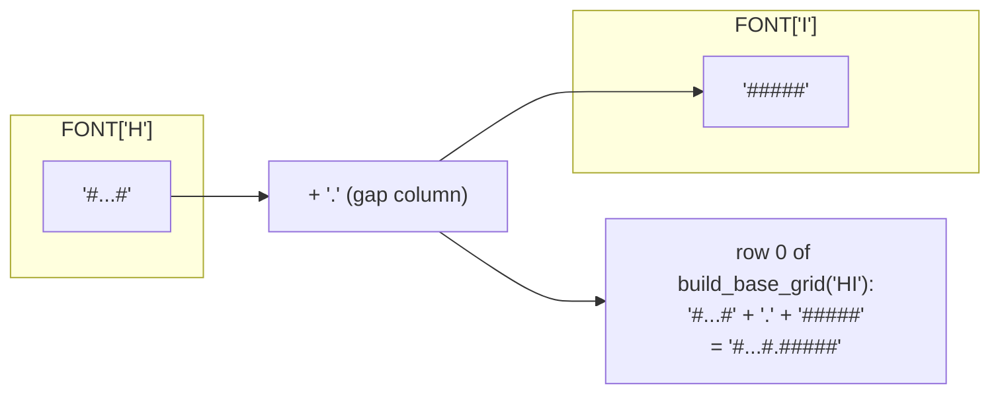
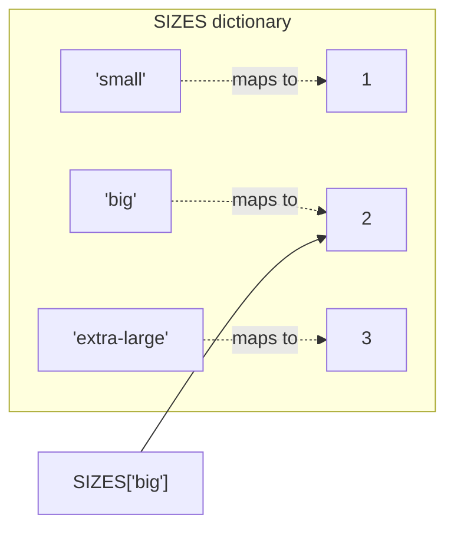
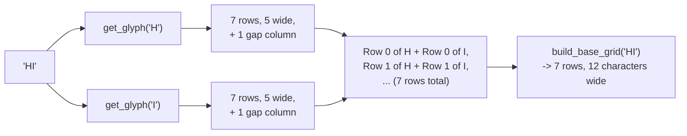
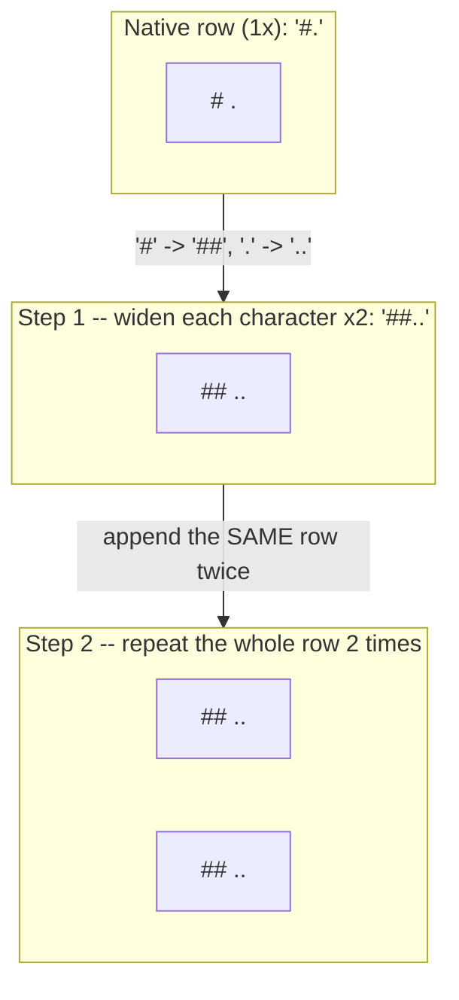

# ASCIIPrint — Design Spec

This document explains **how** and **why** ASCIIPrint is built the way it
is. Read [`README.md`](./README.md) first if you just want to run the
program — come here when you want to understand the design well enough to
extend it yourself.

Every diagram below is [Mermaid](https://mermaid.js.org/) — GitHub, most
IDEs, and the Mermaid Live Editor (<https://mermaid.live>) will render it
as a picture automatically.

---

## 1. Learning goals

This project exists to give you real (not toy) practice with five core
Python building blocks, inside a program small enough to hold in your
head:

| Concept | Where it does real work in this project |
|---|---|
| **Strings** | Every glyph row, like `"#...#"`, is a string; the word you type is a string too |
| **Lists** | `FONT["A"]` is a list of 7 row-strings; the finished output is a list of printable lines |
| **Dictionaries** | `FONT` maps a character to its shape; `SIZES` maps a size name to a scale-up number |
| **Loops** | Walking across every character in the input, and every row of every glyph |
| **Conditionals** | Validating the user's inputs, and falling back to `?` for characters the font doesn't know |

Section 9 below (the concept map) gives exact file/line references.

---

## 2. File layout

```
asciiprint/
├── ascii_art_logic.py       # Pure font data and rendering rules — no input()/print()
├── asciiprint.py             # Interactive program: asks questions, prints the result
├── test_ascii_art_logic.py   # Automated tests (including regression tests) for the logic
├── test_asciiprint.py        # Automated tests for the interactive program itself
├── README.md                  # Quickstart, controls, concept index
└── SPEC.md                    # This file
```

The most important design decision in the whole project is drawn below:
**the font/rendering rules and the interactive program are two separate
files**, exactly like `tetris_logic.py` and `tetris.py` in the sibling
`turtle_tetris` project.



Because `ascii_art_logic.py` never calls `input()` or `print()`, its
tests (`test_ascii_art_logic.py`) can call `render_text()` directly and
check the exact strings it returns — no simulated typing required, and
no window to close when a test hangs.

---

## 3. The font: a dictionary of lists of strings

`FONT` is the heart of the project. Every key is a single character
(`"A"`, `"7"`, `"!"`, `" "`, ...), and every value is a **list of 7
strings**, each 5 characters wide — a tiny 5x7 grid, the same idea used
by real dot-matrix signs.

Three small **type aliases**, defined at the top of `ascii_art_logic.py`,
name these shapes so function signatures read as English:

```python
Row: TypeAlias = str            # one printable row, e.g. "#...#" or "*   *"
Glyph: TypeAlias = list[Row]    # one character's pattern: GLYPH_HEIGHT rows
Grid: TypeAlias = list[Row]     # a whole rendered word: also a list of rows
```

So `FONT` is typed as `dict[str, Glyph]`, and `render_text()` returns a
`Grid` — which mypy checks is really `list[str]` under the hood, but a
reader instantly knows *what kind* of list of strings it is, the same
way `turtle_tetris`'s `type Board = list[list[Cell]]` names its shape.



`"#"` means "this pixel is part of the letter"; `"."` means "leave it
blank." Printing `FONT["A"]` one row at a time already draws a
recognizable letter A:

```
.###.
#...#
#...#
#####
#...#
#...#
#...#
```

`GLYPH_HEIGHT` (7) and `GLYPH_WIDTH` (5) are just those two numbers given
names, so the rest of the code never has a magic `7` or `5` floating
around unexplained.

### 3.1 What is a type hint, and what is a `TypeAlias`?

The `Row: TypeAlias = str` line above uses two ideas that are worth
slowing down on if you haven't seen them before: **type hints** in
general, and **type aliases** in particular.

#### Type hints: optional labels, not enforced rules

A **type hint** is a note you attach to a variable, a function
parameter, or a function's return value, saying what *kind* of value
belongs there. You've already been writing them throughout this
project's function signatures:

```python
def get_glyph(character: str) -> list[str]:
    ...
```

Reading that signature left to right: `character: str` means "the
parameter named `character` should be a string," and `-> list[str]`
means "this function returns a list of strings." Two important facts
about hints like these:

* **Python itself never checks them.** If you called
  `get_glyph(42)` — passing a number instead of a string — Python would
  happily try to run the function, and only fail later (with an
  `AttributeError`, since numbers don't have an `.upper()` method) when
  it actually hit the line that needed a string. The hint `character:
  str` is not a guard rail Python enforces; it's *documentation* your
  editor and a separate tool can read.
* **`mypy` is that separate tool.** Running `mypy --strict
  ascii_art_logic.py` (see the README's "Type checking" section) reads
  every hint in the file and checks, *without running the program at
  all*, whether every call site actually matches — it would flag
  `get_glyph(42)` as an error the moment you saved the file, long before
  you ever ran the program and hit the crash. That's the entire value of
  type hints: catching a whole category of mistakes earlier and for
  free, at the cost of a little extra typing up front.

If none of this existed, the program would run exactly the same —
hints are erased at runtime and have zero effect on behavior. They exist
purely so humans (reading the code) and tools (like mypy and your
editor's autocomplete) can reason about it more easily.

#### Type aliases: giving a hint a name

Once your data gets even a little bit nested, a type hint can turn into
a mouthful. This project's font data is a dictionary that maps a string
to a list of strings:

```python
FONT: dict[str, list[str]] = { ... }
```

That's accurate, but writing `list[str]` again and again — in `FONT`'s
hint, in `get_glyph()`'s return type, in `build_base_grid()`'s return
type, in `UNKNOWN_GLYPH`'s hint — doesn't tell a reader *why* it's a
`list[str]` in each spot. Is it a list of font rows? A list of already-
rendered output lines? Both, as it turns out, but `list[str]` alone
can't say which.

A **type alias** solves this by giving a plain type expression a new,
meaningful name — nothing more:

```python
from typing import TypeAlias

Row: TypeAlias = str            # one printable row, e.g. "#...#" or "*   *"
Glyph: TypeAlias = list[Row]    # one character's pattern: GLYPH_HEIGHT rows
Grid: TypeAlias = list[Row]     # a whole rendered word: also a list of rows
```

Each line reads as an ordinary variable assignment, because that's
almost exactly what it is: `Row` is assigned the value `str`, `Glyph` is
assigned the value `list[Row]` (which mypy resolves to `list[str]`), and
`Grid` is assigned `list[Row]` too. The `: TypeAlias` annotation on the
left tells mypy (and a human skimming the file) "this assignment isn't
creating a normal variable to hold data — it's declaring a *name for a
type*, to be used in hints elsewhere." From that point on, `Glyph` and
`Grid` can be used anywhere a type hint is expected:

```python
FONT: dict[str, Glyph] = { ... }

def get_glyph(character: str) -> Glyph:
    ...

def build_base_grid(text: str) -> Grid:
    ...
```

A few things worth noticing:

* **`Glyph` and `Grid` are both just `list[str]` under the hood.**
  mypy treats them as fully interchangeable with `list[str]` and with
  each other — a type alias adds *readability*, not a new, stricter
  type. Passing a `Grid` where a `Glyph` is expected wouldn't be flagged
  as an error, because to mypy they're the same underlying type wearing
  two different name tags. (If you wanted mypy to treat them as
  genuinely distinct and *reject* mixing them up, you'd reach for a
  different, stricter tool called `NewType` instead — a good thing to
  look up once type aliases feel comfortable, but not needed here.)
* **This still runs on Python 3.11.** A newer Python feature, the
  `type Row = str` statement (no `: TypeAlias`, no import needed), does
  the same job with slightly shorter syntax — that's what the sibling
  `turtle_tetris` project uses for its `type Board = ...` alias — but it
  requires Python 3.12 or later. Since this project's
  [README](./README.md#step-1--install-python-311-or-later) only asks
  for Python 3.11+, `ascii_art_logic.py` uses the older, more widely
  compatible `NAME: TypeAlias = ...` form instead. Both spellings mean
  exactly the same thing to mypy.
* **The payoff shows up at every call site.** Compare
  `get_glyph(character: str) -> list[str]` with
  `get_glyph(character: str) -> Glyph` — the second version tells you,
  without opening `FONT`'s definition, that the return value is "a
  glyph" (a single character's pattern), not just "some list of
  strings" that could mean anything.

### 3.2 Storing one character: it's just a grid of text, nothing fancy

There's no image format, no binary data, and no external font file
anywhere in this project — a "glyph" is stored exactly the way it looks
printed on the page: as **7 plain strings, 5 characters each**, sitting
next to each other in a `list`. That's the entire storage model. Because
a `Glyph` is a `list[str]`, you can reach any single pixel with ordinary
double indexing — `list[row][column]`:

```python
FONT["A"]        # the whole glyph -- a list of 7 strings
FONT["A"][3]     # row 3 (0-indexed, so the 4th row) -- the string "#####"
FONT["A"][3][2]  # column 2 of that row -- the character "#"
                 # (the exact middle of the letter A's horizontal crossbar)
```



Because rows are ordinary strings, "which column" always means "which
character position in that string" — column 0 is the leftmost character,
column `GLYPH_WIDTH - 1` (4) is the rightmost. There's no separate (x, y)
coordinate object anywhere; two nested indexing operations (`[row]`,
then `[column]`) *are* the coordinate system.

This also explains why every glyph **must** be exactly `GLYPH_HEIGHT`
rows of exactly `GLYPH_WIDTH` characters each — if one row of `FONT["A"]`
were only 4 characters instead of 5, `FONT["A"][3][4]` would raise an
`IndexError` the moment `build_base_grid()` tried to line it up next to
a full-width neighbor. `FontDataTests` in `test_ascii_art_logic.py`
exists specifically to catch that kind of mistake before it ever reaches
`build_base_grid()` — see `test_every_glyph_has_correct_height` and
`test_every_glyph_row_has_correct_width`.

### 3.3 A complete worked example: tracing the letter "T" from storage to screen

Let's follow one specific character all the way through, so every idea
in section 3.2 has a concrete example attached to it instead of staying
abstract. We'll use `"T"`, and the goal is to end up with exactly what
`python3 asciiprint.py "T" --char "@" --size small` prints.

**Step 1 — what's actually sitting in `FONT["T"]`.** Laid out with its
row and column indices labeled, so you can see the coordinate system
from section 3.2 applied to a real letter:

| row \ col | 0 | 1 | 2 | 3 | 4 | as a string |
|---|---|---|---|---|---|---|
| **0** | `#` | `#` | `#` | `#` | `#` | `"#####"` |
| **1** | `.` | `.` | `#` | `.` | `.` | `"..#.."` |
| **2** | `.` | `.` | `#` | `.` | `.` | `"..#.."` |
| **3** | `.` | `.` | `#` | `.` | `.` | `"..#.."` |
| **4** | `.` | `.` | `#` | `.` | `.` | `"..#.."` |
| **5** | `.` | `.` | `#` | `.` | `.` | `"..#.."` |
| **6** | `.` | `.` | `#` | `.` | `.` | `"..#.."` |

Row 0 is the solid top bar of the "T"; every row after that has a single
`#` at column 2 (dead center of a 5-wide glyph) — the vertical stem. In
code, `FONT["T"]` is simply:

```python
FONT["T"] = ["#####", "..#..", "..#..", "..#..", "..#..", "..#..", "..#.."]
```

**Step 2 — calling `get_glyph()`.** Suppose the user typed a lowercase
`"t"` (this project accepts either case — see section 5). Tracing
`get_glyph("t")` line by line:

```python
def get_glyph(character: str) -> Glyph:
    return FONT.get(character.upper(), UNKNOWN_GLYPH)
```

1. `character` is `"t"`.
2. `character.upper()` evaluates to `"T"`.
3. `FONT.get("T", UNKNOWN_GLYPH)` looks up the key `"T"` in the `FONT`
   dictionary from Step 1, finds it, and returns that exact list of 7
   strings — the fallback `UNKNOWN_GLYPH` is never used here, because
   `"T"` genuinely is a key in `FONT`.
4. The function returns `["#####", "..#..", "..#..", "..#..", "..#..", "..#..", "..#.."]`.

Compare that with a character the font *doesn't* know, like `"&"`:
`character.upper()` gives `"&"` right back (it has no case to change),
`FONT.get("&", UNKNOWN_GLYPH)` doesn't find `"&"` as a key, so instead of
raising a `KeyError` it returns `UNKNOWN_GLYPH` — the `"?"` glyph from
`FONT["?"]` — which is why `python3 asciiprint.py "T&" --char "@"` draws
a `T` followed by a `?`-shaped block instead of crashing.

**Step 3 — `build_base_grid()` adds a gap column.** Even for a
one-character word, `build_base_grid()` (section 6) glues a single extra
`"."` onto the end of every row — that's the "small gap after each
letter" rule, and it applies uniformly whether there's one more letter
coming or not. So the glyph from Step 1 (5 characters wide) becomes a
6-character-wide **base grid**:

```python
build_base_grid("T") == [
    "#####.",   # "#####" + "."
    "..#...",   # "..#.." + "."
    "..#...",
    "..#...",
    "..#...",
    "..#...",
    "..#...",
]
```

**Step 4 — scaling it.** At `"small"` (multiplier 1), `scale_grid()`
(section 7) leaves this base grid completely unchanged — every row is
repeated 1 time, every character is repeated 1 time, so the output is
identical to the input. (At `"big"` or `"extra-large"` this step is
where the real growth happens — see section 7.2 for a full worked
example of that.)

**Step 5 — turning `"#"`/`"."` into the user's chosen character.**
`render_text()` (section 8) finishes the job with two find-and-replace
passes over every row: every `"#"` becomes the fill character (`"@"` in
this example), and every `"."` becomes a plain space:

```python
"#####.".replace("#", "@").replace(".", " ")   # -> "@@@@@ "
"..#...".replace("#", "@").replace(".", " ")   # -> "  @   "
```

**Step 6 — the result.** Applying Step 5 to all 7 rows from Step 3
reproduces, character for character, what actually prints to the
terminal for `python3 asciiprint.py "T" --char "@" --size small`:

```
@@@@@ 
  @   
  @   
  @   
  @   
  @   
  @   
```

Every row is 6 characters wide (`GLYPH_WIDTH` + 1 gap column), even
though the trailing spaces after each `@` don't show up visually in a
terminal — they're genuinely part of the string, which is exactly why
`RenderTextTests.test_output_line_count_matches_size` and the
`RegressionTests` group in `test_ascii_art_logic.py` compare full row
strings (including trailing spaces) rather than just the visible
characters.

Every rendered word in this program, no matter how long, is just this
same six-step process — lookup, (optionally) fall back to `"?"`, add a
gap, scale, substitute, print — repeated once per character and stitched
together, which is exactly what section 3.4 (a whole word) and section 6
(`build_base_grid()`) cover next.

### 3.4 Storing a whole word: glyphs placed side by side

`FONT` only ever stores *one character at a time*. A whole word like
`"HI"` doesn't get its own dictionary entry — instead,
`build_base_grid()` (walked through in detail in section 6) looks up
each character's glyph separately and glues them together **row by
row**: row 0 of every letter's glyph joins up to form row 0 of the whole
word, row 1 joins row 1, and so on, with one blank `"."` column stitched
in between letters as a gap.



So a rendered word is never one lookup — it's `len(text)` lookups into
`FONT`, one per character, threaded together row-by-row into a brand new
`Grid` that exists only for that call to `render_text()`. Nothing about
a multi-character word is stored anywhere in `FONT` itself; `FONT` only
ever needs to know how to draw one character, and `build_base_grid()`
handles combining them.

---

## 4. Python dictionaries, in depth (a mini tutorial)

`FONT` and `SIZES` are both **dictionaries**, and this project leans on
them harder than almost any other Python feature. If dictionaries are
still new to you, this section is a self-contained tutorial — it also
covers a few related tools (comprehensions and the walrus operator) that
show up in the stretch goals and in idiomatic Python you'll see
elsewhere. Everything here is demonstrated with `FONT`/`SIZES` themselves,
so you can paste any snippet straight into a Python shell inside this
folder and see it work.

### 4.1 What a dictionary actually is

A **list** is a collection you look things up in *by position* — `SIZES`
if it were a list, you'd have to remember "multiplier 2 is at index 1."
A **dictionary** is a collection you look things up in *by name*: every
value is stored under a **key**, and you ask for the value back by
giving that same key.

```python
SIZES = {
    "small": 1,
    "big": 2,
    "extra-large": 3,
}
```



A few key facts:

* **Keys must be unique.** Assigning to an existing key overwrites its
  value — `SIZES["big"] = 5` doesn't add a second `"big"` entry, it
  replaces `2` with `5`.
* **Keys must be "hashable"** — in practice, this almost always means
  strings, numbers, or tuples of those. `FONT`'s keys are all strings
  (`"A"`, `"7"`, `" "`, ...).
* **Values can be anything**, including other collections. `FONT`'s
  values are themselves lists of strings (`Glyph` = `list[str]`) — a
  dictionary mapping to lists is exactly how `FONT` stores a whole
  multi-row picture under one key.
* **Dictionaries remember insertion order.** Since Python 3.7, looping
  over a dictionary always visits its keys in the order they were first
  added — that's what makes `ask_size()`'s numbered menu
  (`asciiprint.py`) line up correctly with `list(SIZES.keys())`.
* **Dictionaries are mutable** — you can add, change, or remove entries
  after creating one, the same way you can with a list.

The basic operations:

```python
sizes = {"small": 1, "big": 2}

sizes["small"]          # 1               -- look up a value by its key
sizes["extra-large"]    # KeyError!       -- looking up a missing key crashes
sizes.get("extra-large")        # None    -- .get() returns None instead of crashing
sizes.get("extra-large", 3)     # 3       -- .get() with a default value

sizes["extra-large"] = 3   # add a brand-new key
sizes["small"] = 1          # or overwrite an existing one -- same syntax either way

"big" in sizes          # True            -- membership test, no error either way
"huge" in sizes          # False

del sizes["big"]         # remove a key (and its value) entirely
sizes.pop("small")       # removes "small" AND returns its value: 1
```

This is exactly the pattern `get_glyph()` uses in `ascii_art_logic.py`
(section 5 below) — `FONT.get(character.upper(), UNKNOWN_GLYPH)` looks up
a character and falls back to a default instead of crashing with a
`KeyError` when the character isn't in the font.

### 4.2 Iterating over a dictionary

There are four ways to loop over a dictionary, and it's worth knowing all
four because you'll see each of them in real code:

```python
sizes = {"small": 1, "big": 2, "extra-large": 3}

# 1. Looping directly over a dict loops over its KEYS.
for name in sizes:
    print(name)                    # small / big / extra-large

# 2. Same thing, spelled out explicitly with .keys().
for name in sizes.keys():
    print(name)                    # identical output to #1

# 3. .values() loops over the VALUES instead, with the keys thrown away.
for multiplier in sizes.values():
    print(multiplier)              # 1 / 2 / 3

# 4. .items() loops over (key, value) PAIRS at the same time.
for name, multiplier in sizes.items():
    print(name, "->", multiplier)  # small -> 1 / big -> 2 / extra-large -> 3
```

That last form — `.items()` — is the one to reach for whenever you need
**both** the key and the value inside the loop body, which is most of
the time. `asciiprint.py`'s `ask_size()` uses the plain key-only form
(`for position, name in enumerate(size_names, start=1)`, where
`size_names` already came from `list(SIZES.keys())`) because it only
needs the names; a function that needed to print `"small is 1x"` for
every entry would reach for `.items()` instead:

```python
for name, multiplier in SIZES.items():
    print(f"{name} is {multiplier}x")
```

### 4.3 List comprehensions

A **list comprehension** is a compact way to build a new list by
transforming (and optionally filtering) every item of an existing
iterable, in one line instead of a multi-line `for` loop with `.append()`.

```python
# The long way, with a plain loop:
letters_only = []
for key in FONT:
    if key.isalpha():
        letters_only.append(key)

# The comprehension way -- exactly the same result, one line:
letters_only = [key for key in FONT if key.isalpha()]
```

The general shape is `[expression for item in iterable if condition]` —
the `if condition` part is optional. `ascii_art_logic.py` itself already
uses this shape inside `scale_grid()`:

```python
wide_row = "".join(character * multiplier for character in row)
```

(That's technically a *generator expression*, not a list comprehension —
same syntax, but wrapped directly in `"".join(...)` instead of `[...]`,
so it never builds an intermediate list at all. The comprehension family
— list, generator, dict, and set — all share this one shape.)

### 4.4 Dictionary comprehensions

The same idea works for building a dictionary: `{key_expr: value_expr
for item in iterable}`. This is handy whenever you want to transform
every value in an existing dictionary without a multi-line loop:

```python
# Double every multiplier in SIZES, the long way:
doubled = {}
for name, multiplier in SIZES.items():
    doubled[name] = multiplier * 2

# The comprehension way:
doubled = {name: multiplier * 2 for name, multiplier in SIZES.items()}
# {'small': 2, 'big': 4, 'extra-large': 6}
```

You could use this for a stretch goal like "add a `--huge` flag that
prints everything at double the normal size" — `huge_sizes =
{name: multiplier * 2 for name, multiplier in SIZES.items()}` builds the
whole new lookup table in one line.

### 4.5 The walrus operator (`:=`)

Python's **assignment expression**, written `:=` and nicknamed the
"walrus operator" (the `:=` looks a bit like a walrus's eyes and tusks),
lets you assign a value to a name *and* use that value in the same
expression — normally, assignment (`=`) is a statement in Python and
can't appear inside an expression at all.

It's most useful inside comprehensions and `if`/`while` conditions, where
it saves you from computing the same thing twice:

```python
words = ["hi", "ok", "hello", "a"]

# Without the walrus operator, len(word) gets computed twice per word
# if you also want to use it: once to filter, once to use the value.
long_words = [word for word in words if len(word) > 2]

# With the walrus operator, len(word) is computed once, bound to `n`,
# and `n` is available for reuse in the same expression:
long_words = [word for word in words if (n := len(word)) > 2]
```

In `ascii_art_logic.py`, `render_text()`'s validation could use it to
avoid computing `sorted(SIZES)` only for the error message:

```python
if size not in SIZES:
    raise ValueError(f"size must be one of: {', '.join(valid := sorted(SIZES))}")
    # `valid` is now available if any later line in this block needed it too.
```

The walrus operator doesn't do anything you *couldn't* already do with
an extra line of code — it's purely a convenience for avoiding repeated
work or repeated lines, so use it when it makes code clearer, not just
because it's available.

---

## 5. `get_glyph()`: looking a character up safely

```python
def get_glyph(character: str) -> Glyph:
    return FONT.get(character.upper(), UNKNOWN_GLYPH)
```

Two small design choices matter here:

* **`.upper()` first** — the font only stores capital letters, so typing
  a name in lowercase (`"maria"`) still works.
* **`.get(..., UNKNOWN_GLYPH)` instead of `FONT[...]`** — if the
  character isn't in the dictionary at all (an emoji, an accented
  letter, a stray symbol), a plain `FONT["@"]` lookup would crash the
  whole program with a `KeyError`. `.get()` with a default value is a
  dictionary's built-in fallback, so an unsupported character just draws
  as a `?` glyph instead of stopping the show.

---

## 6. From a word to a grid: `build_base_grid()`

This function takes a whole string (like `"HI"`) and produces the 7 rows
of the *actual size* (1x) picture, with every letter's glyph glued onto
the row, plus one blank `.` column after each letter as a gap.



The trick is the **outer loop is over characters, the inner loop is over
rows** — for every character, all 7 of its rows get appended to the
matching row of the result, not to 7 brand-new rows. That's why `rows` is
created once, up front, as `["" for _ in range(GLYPH_HEIGHT)]`, and then
built up in place.

---

## 7. From a grid to a size: `scale_grid()`

`SIZES` maps each size name to a **multiplier** — how many times bigger,
in both directions, the native 5x7 grid should be drawn:

| Size name | Multiplier | A glyph's final dimensions |
|---|---|---|
| `"small"` | 1 | 5 wide x 7 tall (exactly as stored in `FONT` — see section 3) |
| `"big"` | 2 | 10 wide x 14 tall |
| `"extra-large"` | 3 | 15 wide x 21 tall |

**Important: "small" is not shrunk — it's the font's true, native size.**
There is no size below `"small"` in this project, because `FONT` doesn't
store any resolution lower than 5x7 to shrink down *to*. `"big"` and
`"extra-large"` are the only two sizes that actually transform anything;
`"small"` passes the grid through a multiplier of 1, which changes
nothing at all (see `ScaleGridTests.test_multiplier_one_leaves_grid_unchanged`
in `test_ascii_art_logic.py`). If you wanted a size *smaller* than the
native font, you couldn't just run this process backward — averaging
every 2x2 block of a 5x7 grid back down to one pixel would land on
fractions of a character (5 isn't evenly divisible by 2), and you'd lose
so much detail that most letters would become unrecognizable blobs.
Shrinking would need a second, separately hand-drawn low-resolution font
(a `TINY_FONT` dictionary, say, at 3x5 instead of 5x7) rather than a math
trick applied to the existing one — which is exactly why "add a `tiny`
size" is listed as a stretch goal in the README rather than a one-line
change to `SIZES`.

### 7.1 How the *expansion* works, step by step

`scale_grid()` turns a 1x grid into an *N*x grid two ways at once, and
the order matters:

1. **Widen every row first.** Each character in the row is repeated `N`
   times in place, so `"#."` at 2x becomes `"##.."` — the row is now `N`
   times as many *characters* wide, but there's still only one such row.
2. **Then duplicate each widened row `N` times**, stacking identical
   copies directly underneath each other.

Doing both steps turns a single "#" pixel into a solid `N` x `N` **square**
block — not a `1` x `N` bar (which is all step 1 alone would give you) and
not an `N` x `1` bar (all step 2 alone would give you). Both steps
together are what keep the letter's proportions square instead of
stretching it sideways or squashing it vertically.



```python
def scale_grid(rows: Grid, multiplier: int) -> Grid:
    scaled_rows: Grid = []
    for row in rows:                                           # for every row...
        wide_row = "".join(character * multiplier for character in row)  # step 1: widen
        for _ in range(multiplier):                              # step 2: stack it
            scaled_rows.append(wide_row)                          #         `multiplier` times
    return scaled_rows
```

### 7.2 A complete worked example: the letter "L"

Here's `FONT["L"]` — 7 rows, 5 characters each, exactly as stored — run
through `scale_grid()` at each size, so you can see precisely how the
data grows. (This calls `scale_grid()` directly on the glyph, skipping
`build_base_grid()`'s gap column, to keep the numbers simple — a full
word goes through both steps, as covered in sections 3.4 and 6.)

**Native storage — `FONT["L"]`, `SIZES["small"] = 1` (5 wide x 7 tall):**

```
#....
#....
#....
#....
#....
#....
#####
```

**`scale_grid(FONT["L"], 2)` for `"big"` (10 wide x 14 tall)** — every
row is twice as wide, and the whole grid has twice as many rows:

```
##........
##........
##........
##........
##........
##........
##........
##........
##........
##........
##........
##........
##########
##########
```

**`scale_grid(FONT["L"], 3)` for `"extra-large"` (15 wide x 21 tall)** —
three times the width, three times the height (21 rows total; shown
truncated here for space, but every row follows the same `character * 3`
widening, and the pattern repeats for 3 identical rows at a time):

```
###............
###............
###............
   ...(15 identical-in-pattern rows follow the same rule)...
###############
###############
###############
```

Notice the growth is **multiplicative in both directions at once**: at
2x, the letter has `2 x 2 = 4` times as many total characters as at 1x
(10x14 = 140 vs. 5x7 = 35); at 3x, it has `3 x 3 = 9` times as many
(15x21 = 315). Doubling the multiplier always quadruples the character
count, never just doubles it — a detail confirmed directly by
`RegressionTests.test_extra_large_size_multiplies_small_size_by_three`
in `test_ascii_art_logic.py`, which checks that the *3x* output has
exactly 3 times the row count **and** 3 times the row width of the *1x*
output, not merely 3 times the total character count.

---

## 8. Putting it together: `render_text()`

`render_text(text, fill_char, size)` is the single function
`asciiprint.py` calls. It does three things, in order:


Validation happens **first**, before any font lookups, so a bad input
(like a size that doesn't exist) never gets partway through building a
grid before failing — it fails fast, with a clear message, right at the
door. This mirrors how real programs are built: check your inputs at the
boundary, then trust them completely for the rest of the function.

---

## 9. Concept map (with file:line references)

| Concept | Where | What to look at |
|---|---|---|
| **Strings** | `ascii_art_logic.py:61-451` | Every glyph row in `FONT`, e.g. `"#...#"` |
| **Strings** | `ascii_art_logic.py:467` | `character.upper()` |
| **Lists** | `ascii_art_logic.py:44-48` | `SIZES` values are plain ints, but every `FONT` entry is a list |
| **Lists** | `ascii_art_logic.py:477` | `rows = ["" for _ in range(GLYPH_HEIGHT)]` |
| **Dictionaries** | `ascii_art_logic.py:44-48` | `SIZES` |
| **Dictionaries** | `ascii_art_logic.py:61-451` | `FONT` |
| **Dictionaries** | `ascii_art_logic.py:467` | `FONT.get(...)` — a dictionary lookup with a default |
| **Loops** | `ascii_art_logic.py:478-482` | `build_base_grid()`'s two nested `for` loops |
| **Loops** | `ascii_art_logic.py:493-496` | `scale_grid()`'s two `for` loops |
| **Loops** | `asciiprint.py` | Every `while True:` prompt loop (`ask_word`, `ask_char`, `ask_size`), plus the `for line in lines:` print loop in `main()` |
| **Conditionals** | `ascii_art_logic.py:510-518` | `render_text()`'s input validation |
| **Conditionals** | `ascii_art_logic.py:467` | The fallback built into `.get(..., UNKNOWN_GLYPH)` |
| **Conditionals** | `asciiprint.py` | Every prompt loop's `if raw == "": ...` / `if raw.isdigit(): ...` checks |
| **Type hints & aliases** | `ascii_art_logic.py:20-38` | The `Row` / `Glyph` / `Grid` `TypeAlias` definitions |
| **Type hints & aliases** | Every function signature in `ascii_art_logic.py` and `asciiprint.py` | Every parameter and return value is annotated; verified with `mypy --strict` |

Every `[TAG]` comment inside `ascii_art_logic.py` and `asciiprint.py`
marks one of these ideas in the exact spot it's being used — search for
`[LOOP]`, `[CONDITIONAL]`, `[STRING]`, `[LIST]`, and `[DICTIONARY]` to
find every occurrence yourself; line numbers shift as the file changes,
so the tags are the reliable way to find them.

---

## 10. Where to go next

* Read [`README.md`](./README.md#stretch-goals) for a list of stretch
  goals, roughly ordered by difficulty.
* Run the tests (`python3 -m unittest discover -p "test_*.py" -v`) and
  read through `test_ascii_art_logic.py` — the test class names
  (`FontDataTests`, `GetGlyphTests`, `BuildBaseGridTests`,
  `ScaleGridTests`, `RenderTextTests`, `RegressionTests`) double as a
  second, executable description of every rule in this document.
* Read `test_asciiprint.py` too — `AskWordTests`, `AskCharTests`, and
  `AskSizeTests` cover every prompt-loop branch, `BuildParserTests`
  covers the `--char`/`--size` command-line flags, and
  `MainEndToEndTests` runs the whole program start to finish (using
  `unittest.mock.patch` to fake typed answers) and checks the exact
  banner it prints.
* Try breaking something on purpose — change a glyph in `FONT`, the gap
  width in `build_base_grid()`, or a validation check in `ask_char()` —
  and watch which tests catch it.
