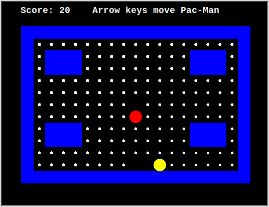

# Turtle Pac-Man

A small, real, playable Pac-Man — built with Python's built-in `turtle`
graphics module — designed as a first project for students who are brand
new to Python. It exists to give you hands-on practice with four core
ideas (**strings, lists, tuples, dictionaries, conditionals**) *and*,
just as importantly, with **automated testing and Test-Driven
Development (TDD)** — the practice of writing a test for a behavior
before you trust the code that implements it.

For a deep dive into *how* it's built (with diagrams) and a full guided
tour of the TDD workflow used to build it, read
[`SPEC.md`](./SPEC.md). This file just gets you running and playing.



*(Captured from an automated test run, so a few dots near Pac-Man have
already been eaten — run it yourself for the full maze!)*

## Getting started (never used Python before? Start here)

Three steps: install Python, download this project, run the game. If
you've done this before, skip to [Step 3](#step-3--run-the-game).

> **A note on `python` vs `python3`:** on Windows the command is usually
> `python`; on macOS and Linux it's usually `python3`. Wherever you see
> `python3` below, Windows users should type `python` instead. If one
> doesn't work, try the other — that's the single most common hiccup.

### Step 1 — Install Python 3.12 or later

First check whether you already have it. Open a terminal
(**Windows:** press Start, type `cmd`, hit Enter · **macOS:** press
`Cmd+Space`, type `terminal`, hit Enter · **Linux:** `Ctrl+Alt+T`) and
run:

```bash
python3 --version
```

If that prints `Python 3.12.0` or higher, you're done — skip to Step 2.
If it prints an older version, or says the command isn't found, install
Python:

**Windows**
1. Go to <https://www.python.org/downloads/> and click the big download
   button.
2. Run the installer, and — this part matters — **tick the box that says
   "Add python.exe to PATH"** at the bottom of the first screen *before*
   clicking Install Now. If you forget, the `python` command won't work
   in your terminal.
3. Close and reopen your terminal, then check with `python --version`.

**macOS**
1. Go to <https://www.python.org/downloads/> and download the macOS
   installer, then run it and click through.
2. Close and reopen Terminal, then check with `python3 --version`.

(If you already use Homebrew, `brew install python@3.12` works too.)

**Linux (Ubuntu / Debian)**

```bash
sudo apt-get install python3 python3-tk
```

The `python3-tk` package is `tkinter`, the toolkit turtle graphics draws
with — it doesn't come with Python by default on Linux.

### Step 2 — Download the project from GitHub

Pick **one** of these two options.

**Option A — Download a ZIP (easiest, no extra tools)**

1. Open
   <https://github.com/olumuyiwaoluwasanmi-codepath/Comp163Projects> in
   your browser.
2. Click the green **Code** button, then **Download ZIP**.
3. Unzip the downloaded file somewhere you'll remember, like your
   Desktop.

**Option B — Clone it with Git (what most programmers do)**

This keeps your copy easy to update later with `git pull`. If you don't
have Git, get it from <https://git-scm.com/downloads> first, then run:

```bash
git clone https://github.com/olumuyiwaoluwasanmi-codepath/Comp163Projects.git
```

That creates a folder named `Comp163Projects` in whatever directory your
terminal is currently in.

### Step 3 — Run the game

In your terminal, move into the project folder and start it. `cd` means
"change directory":

```bash
cd Comp163Projects/pacman
python3 pacman.py
```

A window will open with the maze, Pac-Man, and the ghost already in
place. Use the arrow keys to eat every dot before the ghost catches you!

> **If you downloaded the ZIP**, your folder may be named
> `Comp163Projects-main` or similar — use that name in the `cd` command
> instead. Tip: on Windows and macOS you can type `cd ` (with a space)
> and then drag the folder from your file manager onto the terminal
> window to fill in the path for you.

### If something goes wrong

| What you see | What it means |
|---|---|
| `python3: command not found` | Python isn't installed, or wasn't added to PATH. Redo Step 1 — on Windows, watch for that PATH checkbox. Try `python` instead of `python3`. |
| `No module named 'tkinter'` | Turtle graphics needs `tkinter`. On Linux run `sudo apt-get install python3-tk`; on Windows/macOS, reinstall Python from python.org, which bundles it. |
| `can't open file 'pacman.py'` | You're in the wrong folder. Run `cd pacman` first; `ls` (macOS/Linux) or `dir` (Windows) should list `pacman.py`. |
| `SyntaxError: invalid syntax` pointing at `type Cell` | Your Python is too old (3.11 or earlier). Check with `python3 --version` and install 3.12+ as in Step 1. |

Beyond Python itself there are **no dependencies to install**, and you
don't need an internet connection to play once you have the files.

## Controls

| Key | Action |
|---|---|
| `↑` | Move Pac-Man up one square |
| `↓` | Move Pac-Man down one square |
| `←` | Move Pac-Man left one square |
| `→` | Move Pac-Man right one square |

Movement is one square per keypress (bumping into a wall simply does
nothing) — the ghost moves entirely on its own, chasing Pac-Man
automatically every fraction of a second, whether you press anything or
not. Eat every dot in the maze to win; let the ghost catch you and it's
game over.

## Project files

| File | What's in it |
|---|---|
| `pacman_logic.py` | All the game **rules** — the maze, movement, wall collisions, eating dots, the ghost's chase logic, winning, losing. No drawing code, no window, no keyboard handling. |
| `pacman.py` | The **window** — turns the maze/position data from `pacman_logic.py` into on-screen shapes, and turns arrow-key presses into moves. |
| `test_pacman_logic.py` | 58 automated tests for `pacman_logic.py`. |
| `SPEC.md` | A guided tour of the design *and* of the Test-Driven Development process used to build it, with diagrams. |

Splitting the *rules* from the *drawing* is the single most important
design idea in this project — see [`SPEC.md`](./SPEC.md#2-file-layout)
for why, and how the two files talk to each other.

## Running the tests

`pacman_logic.py` has zero dependency on `turtle` or any window, so its
tests run instantly, with no graphics involved at all:

```bash
cd pacman
python3 -m unittest test_pacman_logic.py -v
```

You should see all 58 tests pass. If you change a rule in
`pacman_logic.py` — say, `SCORE_PER_DOT`, or the shape of the maze — try
running the tests again and see what (if anything) breaks. That's the
whole point of having them!

**New to automated testing or TDD?**
[`SPEC.md` section 9](./SPEC.md#9-test-driven-development-the-point-of-this-whole-project)
walks through building one of this project's own functions
(`choose_ghost_direction()`) test-first, one small Red → Green → Refactor
step at a time, and ends with three concrete "try it yourself" exercises.
That section — not the game itself — is the actual point of this
project.

## Type checking (optional)

Every function in this project declares the types of what it takes in
and what it gives back. Python doesn't check those declarations when it
runs — they're there for you and your editor — but you can have a tool
check them for you:

```bash
pip install mypy
mypy --strict pacman_logic.py pacman.py test_pacman_logic.py
```

All three files pass `--strict` with no errors. Try deliberately
breaking one — for example, change `score += logic.SCORE_PER_DOT` to
`score += "10"` in `pacman.py` — and run it again to see the kind of
mistake this catches *before* you ever start the game.

## Where each concept lives

This is a quick index. [`SPEC.md`](./SPEC.md#10-concept-map-with-fileline-references)
has the full table with exact file/line references and more context —
this is just enough to get you started reading the code with a purpose.

* **Strings** — every row of the maze blueprint, e.g.
  `"#.###.........###.#"`, in `MAZE_TEMPLATE` (`pacman_logic.py`).
* **Lists** — the playable maze grid itself: a list of rows, each row a
  list of one-character cells. Built by `parse_maze()`.
* **Tuples** — every position, like `(6, 9)`, is a `(row, col)` tuple.
  See the `Position` type alias.
* **Dictionaries** — `DIRECTIONS` maps `"UP"`/`"DOWN"`/`"LEFT"`/`"RIGHT"`
  to the `(drow, dcol)` tuple each one means.
* **Conditionals** — wall collisions, "did I eat a dot?", "did the ghost
  catch me?", and "have I won?" are all plain `if` statements.
* **Testing / TDD** — every one of the ideas above has a test in
  `test_pacman_logic.py` that was written to *describe* the rule, not
  just to check it after the fact. See `SPEC.md` section 9.

Every `[TAG]` comment inside `pacman_logic.py` and `pacman.py` marks one
of the four code concepts in the exact spot it's being used — search the
files for `[LOOP]`, `[CONDITIONAL]`, `[STRING]`, `[LIST]`, `[DICTIONARY]`,
and `[TUPLE]` to find every occurrence.

## How does the drawing part work?

Everything on screen is drawn with Python's built-in `turtle` module —
used two different ways in this one project: as a **pen** you steer with
commands like `forward(24)` and `right(90)` (for the maze walls and
dots), and as a **sprite** you simply teleport around with `goto(x, y)`
(for Pac-Man and the ghost). [`SPEC.md` section 5](./SPEC.md#5-how-turtle-graphics-actually-works)
explains both from scratch, plus why turtle's `(0, 0)` is the middle of
the window, how `tracer(0)` + `update()` stop the screen flickering, and
how the game loop runs on timers instead of a `while` loop.

## Stretch goals

Once you're comfortable reading the code — and once you're comfortable
writing a failing test *before* writing the code that fixes it (see
`SPEC.md` section 9) — here are some good next projects, roughly in
order of difficulty:

1. **Change the maze layout, size, or ghost speed.** Edit
   `MAZE_TEMPLATE` in `pacman_logic.py` (keep every row the same
   length!) or `GHOST_STEP_MS` in `pacman.py`. (Strings/lists, constants)
2. **Add a lives system** instead of instant game over — Pac-Man should
   survive a couple of ghost collisions before it's really "game over."
   (Conditionals, an integer counter)
3. **Add a second ghost**, with its own starting position and its own
   call to `move_ghost()` every tick. (Reusing existing functions,
   tuples)
4. **Add power pellets** — a new maze character that, when eaten, makes
   the ghost run *away* from Pac-Man for a few seconds instead of
   chasing. (Conditionals, a countdown timer variable)
5. **Save a high score to a text file** between runs, using Python's
   built-in `open()`. (File I/O, strings)
6. **Give the ghost real pathfinding.** `pacman_logic.py` already ships
   a working breadth-first search, `shortest_path_length()` — used today
   only by the test suite to confirm the maze is fully walkable. Make
   `move_ghost()` use it (recompute the shortest path to Pac-Man every
   tick, and step along it) instead of the simpler heuristic in
   `choose_ghost_direction()`, and watch it stop getting stuck behind
   pillars. See [`SPEC.md` section 7.3](./SPEC.md#73-shortest_path_length--real-pathfinding-for-comparison).

For every one of these, write the failing test first. `SPEC.md` section
9.4 has starter test names for the lives-system and pathfinding ideas
above.

Have fun, and don't be afraid to break it — `test_pacman_logic.py` will
tell you exactly what you broke.
