# Turtle Pac-Man — Design Spec

This document explains **how** and **why** Turtle Pac-Man is built the way
it is, and — because this project exists to teach it — **why testing and
Test-Driven Development (TDD) are woven into every part of the design.**
Read [`README.md`](./README.md) first if you just want to run the game —
come here when you want to understand the design well enough to test it,
extend it, and write your *own* code the same way.

Every diagram below is [Mermaid](https://mermaid.js.org/) — GitHub, most
IDEs, and the Mermaid Live Editor (<https://mermaid.live>) will render it
as a picture automatically.

---

## Table of contents

1. [Learning goals](#1-learning-goals)
2. [File layout](#2-file-layout)
3. [The maze: from a list of strings to a list of lists](#3-the-maze-from-a-list-of-strings-to-a-list-of-lists)
4. [Positions, directions, and the dictionary that ties them together](#4-positions-directions-and-the-dictionary-that-ties-them-together)
5. [How turtle graphics actually works](#5-how-turtle-graphics-actually-works)
6. [From grid cells to screen pixels](#6-from-grid-cells-to-screen-pixels)
7. [Core algorithm walkthroughs](#7-core-algorithm-walkthroughs)
8. [The game as two diagrams](#8-the-game-as-two-diagrams)
9. [Test-Driven Development: the point of this whole project](#9-test-driven-development-the-point-of-this-whole-project)
10. [Concept map (with file:line references)](#10-concept-map-with-fileline-references)
11. [Where to go next](#11-where-to-go-next)

---

## 1. Learning goals

This project exists to give you real (not toy) practice with five core
Python building blocks, **and** with the single habit that separates
hobby coding from professional software engineering: writing tests
*before* — or at least *alongside* — the code they check.

| Concept | Where it does real work in this project |
|---|---|
| **Strings** | Every row of the maze blueprint, e.g. `"#.###.........###.#"` |
| **Lists** | The maze itself is a list of rows; each row is a list of one-character cells |
| **Tuples** | Every position, like `(6, 9)`, is a fixed `(row, col)` pair |
| **Dictionaries** | `DIRECTIONS` maps a direction name to a `(drow, dcol)` tuple |
| **Conditionals** | "Is this a wall?", "Did I eat a dot?", "Did the ghost catch me?", "Have I won?" |
| **Testing / TDD** | Every rule above has a test in `test_pacman_logic.py` *written to describe the rule before trusting the code that implements it* — see [section 9](#9-test-driven-development-the-point-of-this-whole-project) |

Section 10 below (the concept map) gives exact file/line references for
the first five. Section 9 is entirely about the sixth, because it's the
actual point of the project.

---

## 2. File layout

```
pacman/
├── pacman_logic.py       # Pure game rules — no drawing, no window, no keyboard
├── pacman.py              # Turtle window, drawing, keyboard handling
├── test_pacman_logic.py   # Automated tests for pacman_logic.py
├── README.md              # Quickstart, controls, concept index
├── SPEC.md                # This file
└── docs/screenshot.png    # The gameplay image used by the README
```

The most important design decision in the whole project is drawn below:
**game rules and game rendering are two separate files, and only one of
them is ever exercised by the automated tests.**

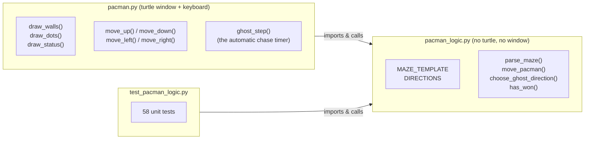

**Why split it this way?** `pacman_logic.py` never opens a window, so it
can be tested in a fraction of a second with plain
`python3 -m unittest` — no clicking, no waiting for animations, no
`tkinter` even needing to be installed. `pacman.py` trusts that logic
completely and only asks three kinds of questions: *"what should I
draw?"*, *"is this move allowed?"*, and *"has the game ended?"*.

This split isn't just tidiness — it's what makes Test-Driven Development
*practical* for this project at all. You cannot easily write a fast,
automated test that clicks a real game window and checks the pixels on
screen. You very easily *can* write a fast, automated test that calls
`move_pacman(grid, (1, 1), "RIGHT")` and checks the tuple it returns.
Every rule worth testing was written so it *could* be tested this way.

---

## 3. The maze: from a list of strings to a list of lists

### 3.1 The blueprint: `MAZE_TEMPLATE`

The maze starts life as the simplest possible sketch of a 2D shape: a
plain **list of strings**, one per row, each one exactly 19 characters
wide (`pacman_logic.py:86`):

```python
MAZE_TEMPLATE: list[str] = [
    "###################",
    "#.................#",
    "#.###.........###.#",
    "#.###.........###.#",
    "#.................#",
    "#.................#",
    "#........G........#",
    "#.................#",
    "#.###.........###.#",
    "#.###.........###.#",
    "#.................#",
    "#........P........#",
    "###################",
]
```

You can *see* the maze's shape just by reading the code: `#` is a wall,
`.` is a dot, `P` is where Pac-Man starts, `G` is where the ghost starts.
That readability is worth a lot — but a plain string has a problem for a
game: **strings are immutable in Python**. You can't do
`row[5] = " "` to erase a dot once it's eaten; Python will raise a
`TypeError`. So the blueprint is never played on directly.

### 3.2 Turning the blueprint into a playable grid

`parse_maze()` (`pacman_logic.py:103`) converts the blueprint into
something that *can* change over time: a **list of lists**, where each
row-string has been exploded into a list of its individual characters
with the built-in `list(row_string)`.

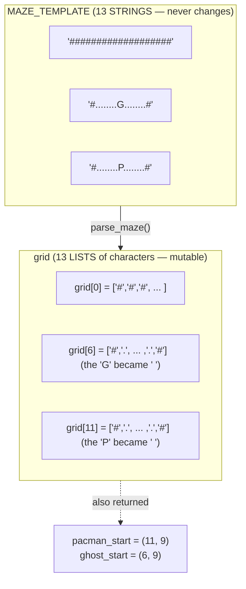

Three things happen in the same pass over the blueprint
(`pacman_logic.py:113`–`124`):

1. Every row **string** is converted to a **list** of one-character
   cells with `list(row_string)`.
2. Every `"P"` and `"G"` character found is remembered as a `(row, col)`
   **tuple**, *and* replaced with plain open floor (`EMPTY`) — the
   playable grid itself never contains a `"P"` or a `"G"`; those two
   letters exist only in the blueprint.
3. The finished grid, plus the two remembered starting positions, are
   returned together as a 3-tuple.

> **Beginner trap this design avoids:** if you tried to build the grid
> with something like `[list(row)] * 13`, every row would secretly be
> the *same* list — editing `grid[0][0]` would also change `grid[1][0]`,
> `grid[2][0]`, and so on. `parse_maze()` builds each row separately
> inside its loop specifically to avoid this.
> `ParseMazeTests.test_rows_are_independent_lists` in the test file
> exists to catch this exact bug if it's ever reintroduced — see
> section 9 for why writing that test *before* trusting the code is the
> whole point.

### 3.3 Reading the grid: `grid[row][col]`

Once parsed, every square is addressed the same way throughout the rest
of the program: **row first, then column** — `grid[row][col]` — which
matches how you'd read a grid on paper, top row first, left-to-right
within each row. `is_wall()` (`pacman_logic.py:161`) is the simplest
possible example:

```python
def is_wall(grid, row, col):
    return grid[row][col] == WALL
```

---

## 4. Positions, directions, and the dictionary that ties them together

A position is always a plain `(row, col)` **tuple** — never a custom
class, never two separate variables passed around together. Pac-Man's
position, the ghost's position, and every square you ever ask "is this a
wall?" about are all the exact same shape of data, which is what lets one
function like `can_move()` work for both Pac-Man *and* the ghost.

`DIRECTIONS` (`pacman_logic.py:66`) is the **dictionary** that makes
"move UP" into actual arithmetic:

```python
DIRECTIONS: dict[str, tuple[int, int]] = {
    "UP": (-1, 0),
    "DOWN": (1, 0),
    "LEFT": (0, -1),
    "RIGHT": (0, 1),
}
```

```mermaid
flowchart LR
    D["DIRECTIONS  (dict)"] -->|'\"UP\"'| U["(-1, 0)"]
    D -->|'\"DOWN\"'| Dn["(1, 0)"]
    D -->|'\"LEFT\"'| L["(0, -1)"]
    D -->|'\"RIGHT\"'| R["(0, 1)"]
```

Why is `"UP"` paired with a *negative* row change? Because the grid
counts rows from the top down — row 0 is the topmost row — so moving
"up" the screen means *decreasing* the row number. This single design
choice (row 0 = top) is why every function that deals with direction
only has to get this backwards-seeming detail right in exactly one
place: `move_position()` (`pacman_logic.py:201`):

```python
def move_position(position, direction):
    row, col = position
    drow, dcol = DIRECTIONS[direction]
    return (row + drow, col + dcol)
```

Everything that moves anything — Pac-Man, the ghost, even the
hypothetical "what if I stepped that way?" checks in `can_move()` — funnels
through this one function.

---

## 5. How turtle graphics actually works

Everything you see on screen is drawn by Python's built-in `turtle`
module. This project actually uses **two different mental models** of a
turtle side by side, which is a great way to see the tool's whole range.

### 5.1 Model one: a turtle as a pen you give directions to

Picture a robot turtle sitting on a giant sheet of paper, holding a pen.
You never tell it "draw a square at position (50, 80)". You tell it how
to *walk*, and the pen leaves a trail behind it:

```python
pen.forward(24)   # walk 24 pixels in the direction you're facing
pen.right(90)     # turn 90 degrees clockwise (on the spot)
```

Do those two things four times and you've walked a complete square.
That's exactly how `draw_wall_square()` (`pacman.py:132`) draws every
wall block:

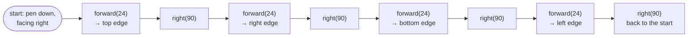

```python
for _ in range(4):      # [LOOP]
    wall_pen.forward(CELL_SIZE)
    wall_pen.right(90)
```

**Filling with color.** An outline isn't enough — the walls need to be
solid blue. So the square-drawing loop is wrapped in a fill:

```python
wall_pen.fillcolor("blue")
wall_pen.begin_fill()
...draw the four sides...
wall_pen.end_fill()      # everything enclosed since begin_fill() is now filled in
```

`wall_pen` is used this way once at startup for every wall square
(`draw_walls()`, `pacman.py:159`) and never touched again — the walls
never move or disappear.

**Dots use an even simpler pen trick.** Rather than drawing four sides
for each dot, `draw_dots()` (`pacman.py:177`) uses turtle's built-in
`.dot()` method, which stamps a single filled circle at the pen's current
position in one call:

```python
dot_pen.goto(x, y)
dot_pen.dot(CELL_SIZE // 4, "white")
```

Because dots disappear one at a time as Pac-Man eats them, `dot_pen` is
cleared and completely **redrawn from scratch** every single frame —
unlike `wall_pen`, which draws once and is never touched again. Section
5.4 explains why redrawing everything every frame doesn't make the game
slow or flickery.

### 5.2 Model two: a turtle as an actor (a sprite)

Pac-Man and the ghost work completely differently. Instead of walking a
pen around to draw a shape, `pacman_turtle` and `ghost_turtle`
(`pacman.py:117`, `:124`) are each given a built-in `"circle"` **shape**
once, and from then on are simply *teleported* to wherever they need to
be with `.goto(x, y)`:

```python
pacman_turtle.shape("circle")
pacman_turtle.color("yellow")
...
pacman_turtle.goto(x, y)   # jump straight there — no trail, no walking
```

`.penup()` is called once, right after creating each of these turtles,
so that `.goto()` never leaves a trail behind it. This is the same
turtle module, but used as a **sprite** (a movable picture) instead of a
**pen** (a drawing tool) — the same contrast between "a paintbrush" and
"a character on screen" that shows up in almost every simple 2D game
engine, turtle included.

### 5.3 Turtle's coordinate system

Turtle puts `(0, 0)` at the **center** of the window, with `x` growing
right and `y` growing **up** — like graph paper in maths class, not like
a computer screen:

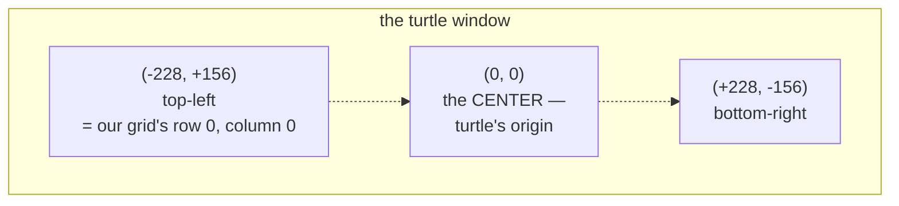

Our grid, meanwhile, counts rows from the top downwards (row 0 is the
top row). Those two disagree about which way is "down", which is exactly
why the conversion in section 6 *subtracts* for `y`.

### 5.4 Why the screen doesn't flicker: `tracer(0)` and `update()`

By default, turtle *animates* every single drawing command — you'd watch
the pen crawl across all 161 dots and every wall block, one line segment
at a time, every single frame. That would be unwatchably slow and would
visibly flicker as it erased and redrew.

The fix is two lines, both near the top of `pacman.py`:

* `screen.tracer(0)` — at startup, switches off automatic redrawing.
  Drawing commands now happen invisibly, off-screen.
* `screen.update()` — after a frame is fully drawn, show all of it at
  once.

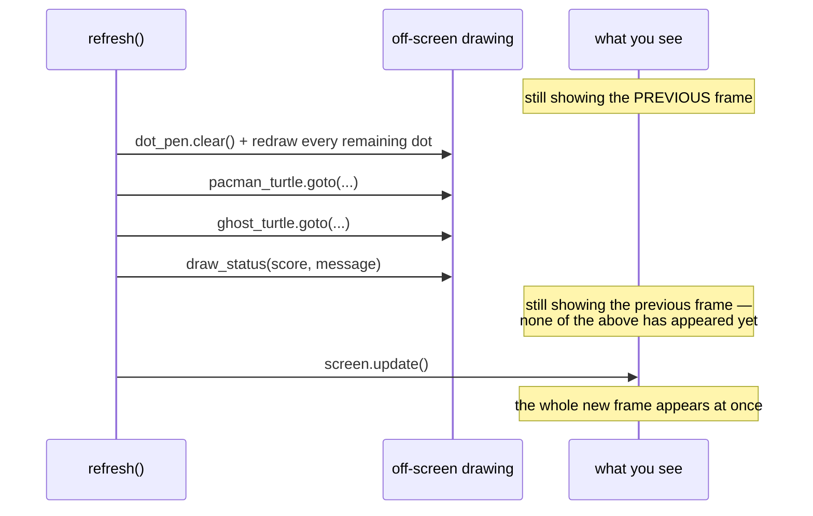

Showing only finished frames is a standard game-programming technique
called **double buffering**. It's the difference between watching
someone paint and being handed the finished painting.

### 5.5 The game loop is made of timers, not a `while` loop

A beginner's instinct for a game loop is:

```python
while True:              # DON'T do this with turtle
    move_ghost_one_step()
    time.sleep(0.4)
```

That freezes the window. Turtle needs to be free to notice key presses
and repaint the window, and a `while True` loop never gives it the
chance, so the window stops responding entirely.

Instead, you hand turtle a function and ask it to call you back later:

```python
screen.ontimer(ghost_step, GHOST_STEP_MS)   # "call ghost_step() in 400ms"
```

The trick is that `ghost_step()` (`pacman.py:322`) ends by scheduling
*itself* again. Each call sets up the next one, so the ghost keeps
chasing forever without any `while` loop at all.

### 5.6 Keyboard input

Three pieces have to line up for a key press to reach your code:

```python
screen.listen()                     # give the window keyboard focus
screen.onkey(move_left, "Left")     # when Left is pressed, call move_left()
screen.mainloop()                   # hand control to turtle: watch for
                                     # key presses and timers, forever
```

Note that you pass `move_left` **without** parentheses. `move_left()`
with parentheses would call the function immediately and hand turtle its
return value; `move_left` without them hands over the function itself,
to be called later. Mixing these up is one of the most common beginner
bugs in event-driven code.

Turtle's key names are strings: `"Up"`, `"Down"`, `"Left"`, `"Right"`
(capitalized).

`mainloop()` is the last line of the program and never returns — from
that point on, everything that happens is turtle calling one of your
functions, either because a key was pressed or because a timer expired.

---

## 6. From grid cells to screen pixels

`pacman_logic.py` only ever talks about rows and columns (`0..12`,
`0..18`). `pacman.py` is the only file that knows about pixels, and the
translation happens in exactly two small functions, because walls and
"sprites" need slightly different reference points:

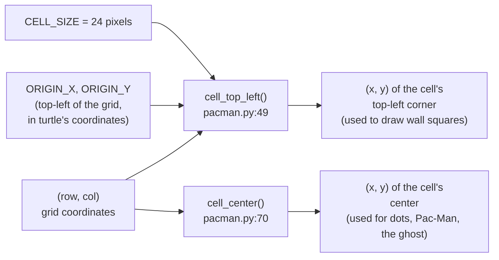

```python
def cell_top_left(row, col):
    x = ORIGIN_X + col * CELL_SIZE
    y = ORIGIN_Y - row * CELL_SIZE     # subtract, because row grows DOWN
                                          # but turtle's y-axis grows UP
    return x, y


def cell_center(row, col):
    x, y = cell_top_left(row, col)
    return x + CELL_SIZE / 2, y - CELL_SIZE / 2
```

Keeping this conversion in two small functions means the rest of the
drawing code never has to think about pixels at all — it just says "put
a wall square at row 2, column 4" or "put Pac-Man at row 11, column 9".

---

## 7. Core algorithm walkthroughs

### 7.1 `can_move()` — is this one step legal?

Every move in the game — Pac-Man's, and the ghost's — asks this same
question first:

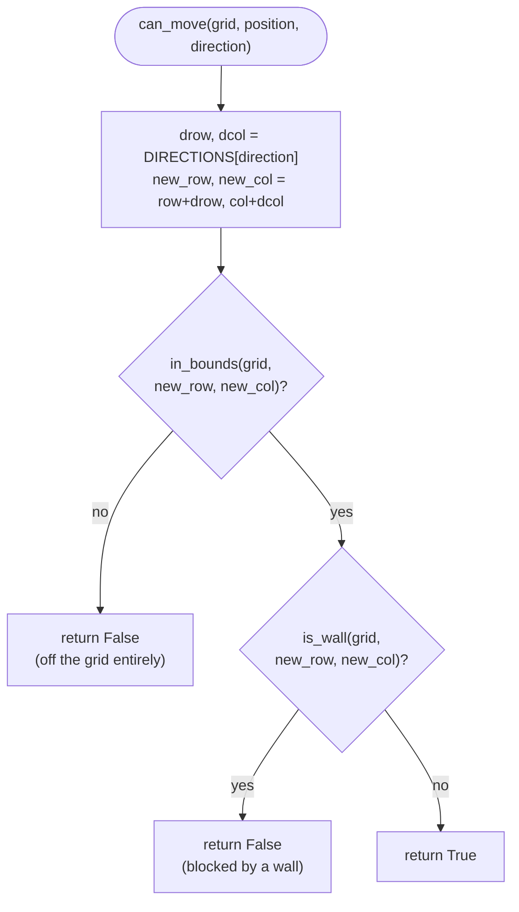

`can_move()` (`pacman_logic.py:177`) is reused for *everything* that
needs to check a move, just by passing a different starting position:

| Question asked | Call |
|---|---|
| Can Pac-Man move right? | `can_move(grid, pacman_position, "RIGHT")` |
| Can the ghost move down? | `can_move(grid, ghost_position, "DOWN")` |

### 7.2 `choose_ghost_direction()` — a heuristic, not a maze-solver

The ghost does not plan a whole route to Pac-Man. Every turn, it asks a
much simpler question: *"is Pac-Man mostly above/below me, or mostly
left/right of me?"*, and tries to close **that** gap first.

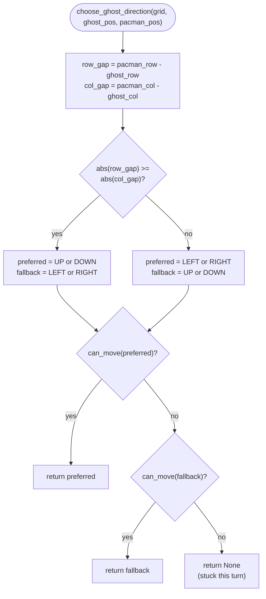

This is a **heuristic**, not real pathfinding, and that's deliberate:
it's simple enough to read in thirty seconds, and simple enough to
predict exactly what it will do in any situation — both important
qualities for a *first* AI a student writes. It also has an honest
weakness, on purpose: `test_gives_up_this_turn_when_the_only_preferred_axis_is_blocked`
in the test file documents a case where the ghost gets stuck behind a
pillar even though a path around it exists, simply because its one
"sideways" fallback also happens to be zero (Pac-Man is directly north
or south of it). **A real maze-solver wouldn't have this problem** —
which is exactly what section 7.3 is for.

### 7.3 `shortest_path_length()` — real pathfinding, for comparison

This function is not used by the playable ghost at all. It exists for
two reasons: to give the test suite a way to prove the shipped maze is
fully walkable (`test_shipped_maze_template_is_fully_connected`), and to
give you a working example of **breadth-first search (BFS)** — the
standard algorithm for "shortest path with no weights" — to compare
against the ghost's much simpler heuristic.

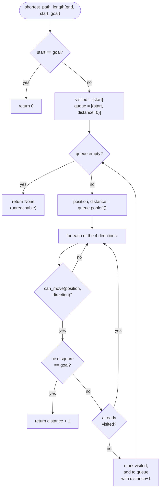

The key idea of BFS: a `queue` (Python's `collections.deque`) always
explores every square exactly **one step away** before it looks at any
square **two steps away**, which is exactly what guarantees the first
time you reach `goal` is via the *shortest* possible path. Compare that
guarantee to `choose_ghost_direction()`'s heuristic, which has no such
guarantee at all — a good concrete example of the tradeoff between
"simple and predictable" and "correct in every case."

**Stretch goal:** replace the ghost's heuristic with
`shortest_path_length()`-style BFS (having it recompute and follow the
first step of the real shortest path every turn) and watch it stop
getting stuck behind pillars. See the README's stretch goals section.

---

## 8. The game as two diagrams

### 8.1 State diagram: one full game

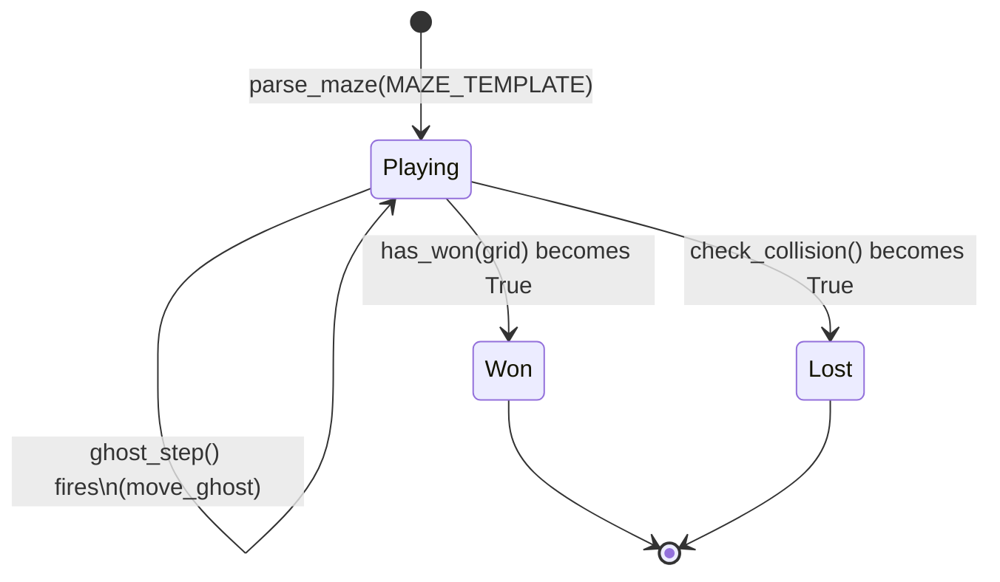

Notice both `Won` and `Lost` are checked after *both* kinds of move —
Pac-Man eating the very last dot, and the ghost stepping onto Pac-Man's
square — because either one can happen on either turn.

### 8.2 Sequence diagram: one ghost tick

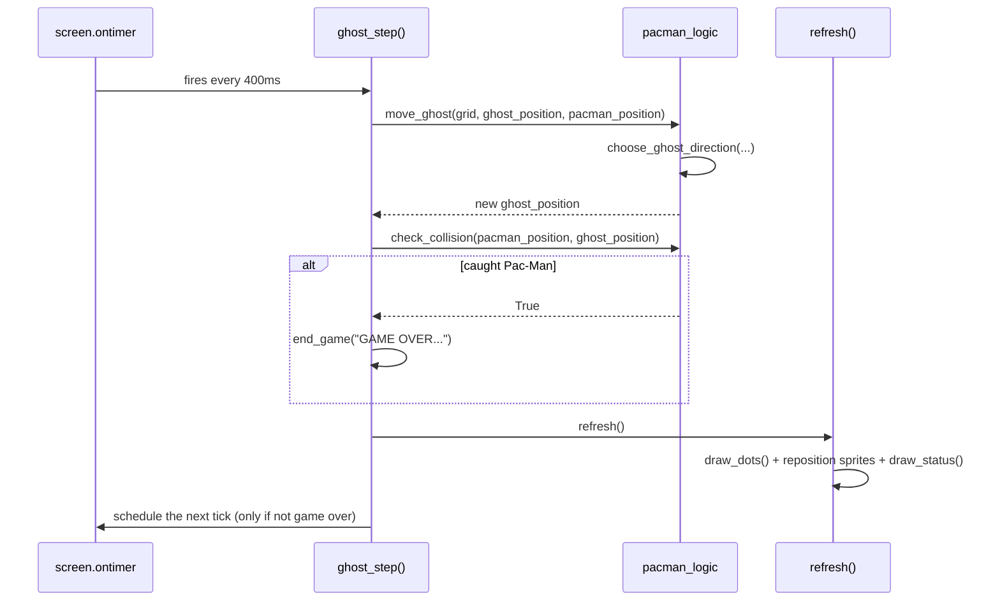

---

## 9. Test-Driven Development: the point of this whole project

Everything above explains *how* the game works. This section explains
*why* every rule in `pacman_logic.py` has a test that was written to
describe it — which is the actual reason this project exists.

### 9.1 What TDD is

Test-Driven Development means writing the **test for a behavior before
you trust the code that implements it** — often before the code even
exists yet. It's a short, repeating cycle with a name for each step:

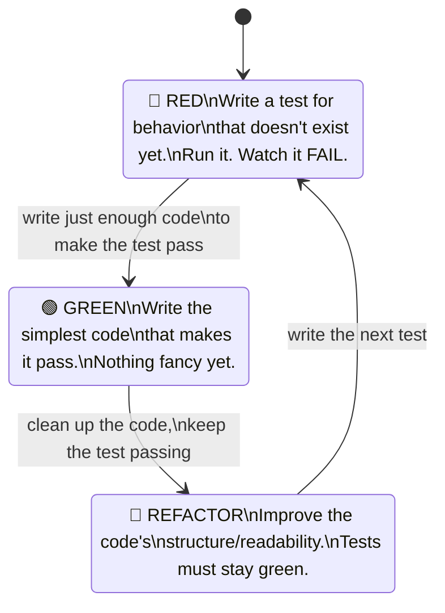

The **Red** step is not a formality — it's the whole point. If you
write a test and it *passes immediately* without you writing any new
code, that test isn't checking what you think it's checking. Watching a
test fail first is how you prove the test can actually catch the bug it
exists to catch.

### 9.2 Walking through a real example: building `choose_ghost_direction()`

Here is (a simplified version of) how `choose_ghost_direction()`
actually came together, one test at a time.

**Step 1 — 🔴 Red.** Before writing any logic, write down one clear,
small expectation as a test:

```python
def test_prefers_moving_down_when_pacman_is_mostly_below(self) -> None:
    direction = logic.choose_ghost_direction(self.open_grid, (1, 3), (5, 3))
    self.assertEqual(direction, "DOWN")
```

Run it: `python3 -m unittest test_pacman_logic.py`. It fails —
`choose_ghost_direction` doesn't exist yet, so Python raises an
`AttributeError`. **That failure is expected and correct.** It proves
the test is actually exercising something real.

**Step 2 — 🟢 Green.** Write the smallest amount of code that could
possibly make that one test pass:

```python
def choose_ghost_direction(grid, ghost_position, pacman_position):
    return "DOWN"   # obviously not the real logic yet!
```

Run the test again. It passes. This looks silly — and it is — but it's
a genuine checkpoint: the function exists, is importable, and returns
the right *type* of answer.

**Step 3 — 🔴 Red, again.** Add the next test, one that the fake
`"DOWN"`-always implementation cannot possibly pass:

```python
def test_prefers_moving_up_when_pacman_is_mostly_above(self) -> None:
    direction = logic.choose_ghost_direction(self.open_grid, (5, 3), (1, 3))
    self.assertEqual(direction, "UP")
```

Run the tests. The new one fails (as expected), and — just as
importantly — **the old one still passes**, which is a second kind of
guarantee TDD gives you for free: a growing pile of tests keeps checking
old behavior even while you're focused on new behavior.

**Step 4 — 🟢 Green, again.** Now the fake implementation has to be
replaced with something real:

```python
def choose_ghost_direction(grid, ghost_position, pacman_position):
    row_gap = pacman_position[0] - ghost_position[0]
    if row_gap > 0:
        return "DOWN"
    if row_gap < 0:
        return "UP"
    return None
```

Both tests pass now.

**Step 5 — repeat.** Add a test for the column axis. Watch it fail (the
function above never even looks at columns). Extend the implementation.
Add a test for "prefer the bigger gap." Watch it fail. Extend the
implementation again. Add a test for "fall back to the other axis if
the first choice hits a wall." Watch it fail. Add the fallback logic.

By the time every test in `ChooseGhostDirectionTests` passes, the
function has grown, one small provable step at a time, into exactly the
version in `pacman_logic.py:308` — and you have eight small tests
sitting there forever afterward, ready to immediately tell you if a
future change breaks any one piece of that behavior.

### 9.3 Why this matters more than the pass/fail checkmark

* **Tests are a specification you can run.** `MovePacmanTests.test_bumping_into_a_wall_leaves_position_unchanged`
  says, unambiguously, exactly what should happen at a wall — more
  precisely than a comment ever could, because a comment can go stale
  and a test cannot: if it stops being true, the test suite turns red
  and tells you.
* **Tests turn "I think I didn't break anything" into "I know I didn't
  break anything."** Try it yourself: change `SCORE_PER_DOT` from `10`
  to `5` in `pacman_logic.py`, then run the test suite. Watch exactly
  which test tells you your change had a side effect you didn't expect.
* **Writing the test first forces you to design the function's
  interface before its implementation.** Notice that every test above
  was written by *imagining calling the function*, not by reading its
  body — because its body didn't exist yet. That's a genuinely
  different (and, once it feels natural, easier) way to design code.
* **Small, focused tests turn big scary changes into small safe ones.**
  Refactoring `clear_full_rows()`-style logic (or anything else) with
  58 fast tests standing guard is a completely different, much less
  stressful experience than refactoring the same code with zero tests
  and just hoping you didn't break the game.

### 9.4 Try it yourself

The best way to actually learn TDD is to do it, not read about it. Pick
one of these and follow the Red → Green → Refactor cycle from section
9.1 for each small piece of behavior, committing after each Green step:

1. **Add a second dot value.** Some mazes give bonus dots worth more
   points. Write `test_eating_a_bonus_dot_awards_more_points` — and
   watch it fail — before adding a `BONUS_DOT` character or bonus
   scoring logic.
2. **Add a lives system.** Instead of instant game over, Pac-Man should
   survive a few ghost collisions. Start with
   `test_first_collision_does_not_end_the_game` (must fail first!),
   then `test_third_collision_ends_the_game`.
3. **Make the ghost smarter with real pathfinding** (see section 7.3).
   Start with a test that currently *fails* against the existing
   heuristic — e.g. a maze shaped exactly like
   `test_gives_up_this_turn_when_the_only_preferred_axis_is_blocked`,
   but this time asserting the ghost *does* find its way around the
   pillar — before changing `move_ghost()` to call
   `shortest_path_length()`-style BFS instead.

Whichever you pick, resist the urge to write the feature first and the
test "to check it" afterward. The whole exercise is watching a red test
turn green *because of* code you just wrote, on purpose, one small step
at a time.

---

## 10. Concept map (with file:line references)

Line numbers are accurate as of this writing; if you edit the files,
search for the function name instead of trusting the number forever.

| Concept | Example | Location |
|---|---|---|
| **String** | `"#.###.........###.#"` — one maze row | `MAZE_TEMPLATE`, `pacman_logic.py:86` |
| **String → List** | `list(row_string)` | `parse_maze()`, `pacman_logic.py:113` |
| **List of lists** | `grid` itself (a 2D grid of characters) | `parse_maze()`, `pacman_logic.py:103` |
| **Tuple** | `(row, col)` — every position in the game | `Position` type alias, `pacman_logic.py:36` |
| **Dictionary** | `DIRECTIONS` maps a name to a `(drow, dcol)` tuple | `pacman_logic.py:66` |
| **for loop** | scanning every grid cell to draw walls/dots | `draw_walls()`/`draw_dots()`, `pacman.py:159`, `:177` |
| **for loop** | trying the preferred then fallback ghost direction | `choose_ghost_direction()`, `pacman_logic.py:308` |
| **while loop** | draining the BFS queue | `shortest_path_length()`, `pacman_logic.py:383` |
| **if / elif / else** | wall vs. edge vs. open floor | `can_move()`, `pacman_logic.py:177` |
| **if / else** | "was there a dot here?" | `eat_dot()`, `pacman_logic.py:246` |
| **if / elif** | "is the game over — won, lost, or still playing?" | `try_move_pacman()`, `pacman.py:274` |
| **Automated test** | one behavior, described before it's trusted | every method in `test_pacman_logic.py` |

---

## 11. Where to go next

The [README](./README.md) has a "Stretch goals" section with concrete
next features (a smarter ghost, a second ghost, power pellets, a lives
system, a high-score file) — each one is a good excuse to practice one
of the concepts above, **using the Red → Green → Refactor cycle from
section 9** rather than skipping straight to the implementation.
