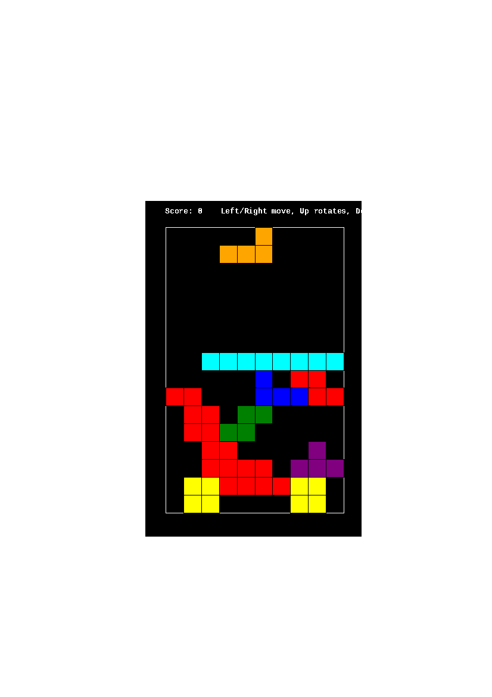

# Turtle Tetris

A small, real, playable Tetris — built with Python's built-in `turtle`
graphics module — designed as a first project for students who are brand
new to Python. It exists to give you hands-on practice with six core
ideas: **strings, tuples, lists, dictionaries, loops, and conditionals**,
all working together in one program you can actually play.

For a deep dive into *how* it's built (with diagrams), read
[`SPEC.md`](./SPEC.md). This file just gets you running and playing.



*(Captured from an automated test run, so the window is cropped a bit oddly — run it yourself for the full picture!)*

## Requirements

* Python 3.10 or later (the code uses modern type hints like `str | None`).
* The `turtle` module, which ships with almost every Python install. It
  needs `tkinter`, which is bundled with Python on Windows and macOS. On
  Linux, if you get `ModuleNotFoundError: No module named 'tkinter'`,
  install it with your package manager, e.g.:
  ```bash
  sudo apt-get install python3-tk
  ```
* No other dependencies, and no internet connection needed to play.

## How to run it

```bash
cd turtle_tetris
python3 tetris.py
```

A window will open with an empty board and a piece already falling.

## Controls

| Key | Action |
|---|---|
| `←` | Move the piece one column left |
| `→` | Move the piece one column right |
| `↓` | Soft drop — move down one row early |
| `↑` | Rotate the piece |
| `Space` | Hard drop — instantly slam the piece to the bottom |

The piece also falls on its own every half second, whether you press
anything or not — just like real Tetris.

The board is 10 columns wide and 16 rows tall. Clearing 1/2/3/4 rows at
once with a single piece scores 100/300/500/800 points, in that order —
so it's worth trying to clear several lines at once!

## Project files

| File | What's in it |
|---|---|
| `tetris_logic.py` | All the game **rules** — the board, the seven tetromino shapes, collision checking, locking pieces, clearing lines, scoring. No drawing code, no window, no keyboard handling. |
| `tetris.py` | The **window** — turns the board/piece data from `tetris_logic.py` into on-screen squares, and turns key presses into moves. |
| `test_tetris_logic.py` | 37 automated tests for `tetris_logic.py`. |
| `SPEC.md` | A guided tour of the design, with diagrams. |

Splitting the *rules* from the *drawing* is the single most important
design idea in this project — see [`SPEC.md`](./SPEC.md#2-file-layout)
for why, and how the two files talk to each other.

## Running the tests

`tetris_logic.py` has zero dependency on `turtle` or any window, so its
tests run instantly, with no graphics involved at all:

```bash
cd turtle_tetris
python3 -m unittest test_tetris_logic.py -v
```

You should see all 37 tests pass. If you change a rule in
`tetris_logic.py` — say, the scoring table, or a piece's shape — try
running the tests again and see what (if anything) breaks. That's the
whole point of having them!

## Where each concept lives

This is a quick index. [`SPEC.md`](./SPEC.md#9-concept-map-with-fileline-references)
has the full table with exact file/line references and more context —
this is just enough to get you started reading the code with a purpose.

* **Strings** — piece names like `"T"` and color names like `"cyan"`,
  all through `SHAPES` and `COLORS` in `tetris_logic.py`.
* **Tuples** — every block position, like `(1, 0)`, is a `(column, row)`
  tuple. See any entry inside `SHAPES`.
* **Lists** — the board itself (`new_board()`), and each piece's shape
  data (`SHAPES["T"]` is a list of rotation states).
* **Dictionaries** — `SHAPES`, `COLORS`, and every `piece` object are all
  plain dictionaries. Try `print(piece)` anywhere in `tetris.py` to see
  one for yourself.
* **Loops** — `for` loops scan the board to draw it (`draw_board()`) and
  check every block of a piece (`valid_position()`); a `while` loop
  refills the board after clearing lines (`clear_full_rows()`).
* **Conditionals** — collision checks, "is this row full?", and "is the
  game over?" are all plain `if` statements.

Every `[TAG]` comment inside `tetris_logic.py` and `tetris.py` marks one
of these six ideas in the exact spot it's being used — search the files
for `[LOOP]`, `[CONDITIONAL]`, `[STRING]`, `[LIST]`, `[DICTIONARY]`, and
`[TUPLE]` to find every occurrence.

## Stretch goals

Once you're comfortable reading the code, here are some good next
projects, roughly in order of difficulty:

1. **Change the board size or fall speed.** Edit `COLS`/`ROWS` in
   `tetris_logic.py` or `FALL_DELAY_MS` in `tetris.py`. (Loops/constants)
2. **Add a "next piece" preview** in the corner of the window. You'll
   need to generate the *next* piece ahead of time instead of only when
   the current one locks. (Dictionaries, functions)
3. **Speed the game up as the score increases** — e.g. shrink
   `FALL_DELAY_MS` every time the score crosses a multiple of 1000.
   (Conditionals)
4. **Save a high score to a text file** between runs, using Python's
   built-in `open()`. (File I/O, strings)
5. **Add a "ghost piece"** — a faint outline showing where the current
   piece would land if hard-dropped right now. (Reuse `valid_position()`
   in a loop, just like `hard_drop()` already does.)
6. **Add wall kicks** — when a rotation would normally be rejected near
   a wall, try shifting the piece 1 column left or right before giving
   up. (Conditionals, and a great excuse to re-read
   `valid_position()`.)
7. **Rewrite `Piece` as a `@dataclass`** instead of a dictionary, once
   dictionaries feel completely natural — a good way to see *why*
   classes exist, having already done the same job with a dictionary.

Have fun, and don't be afraid to break it — `test_tetris_logic.py` will
tell you exactly what you broke.
