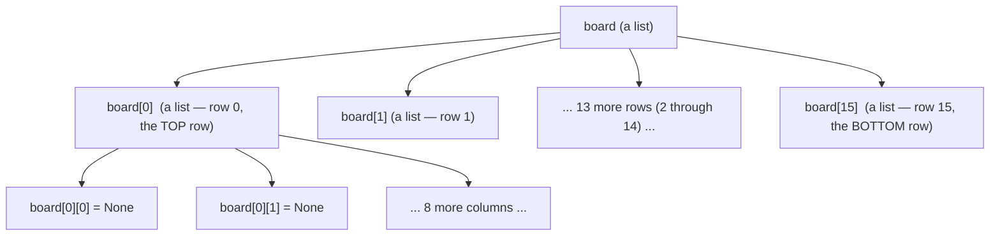
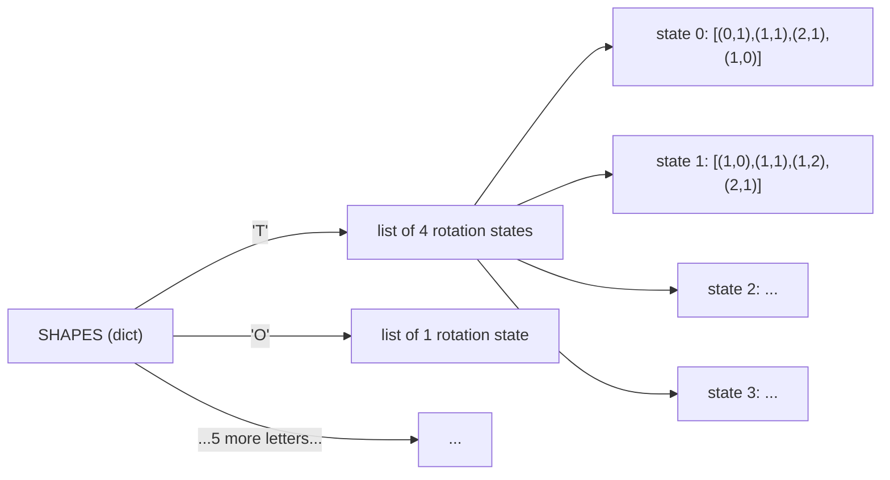
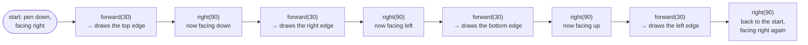
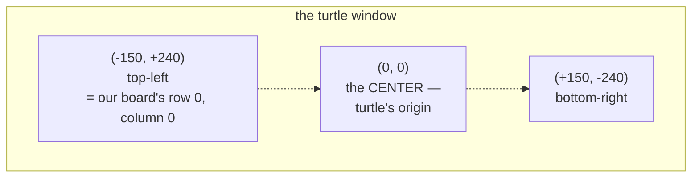
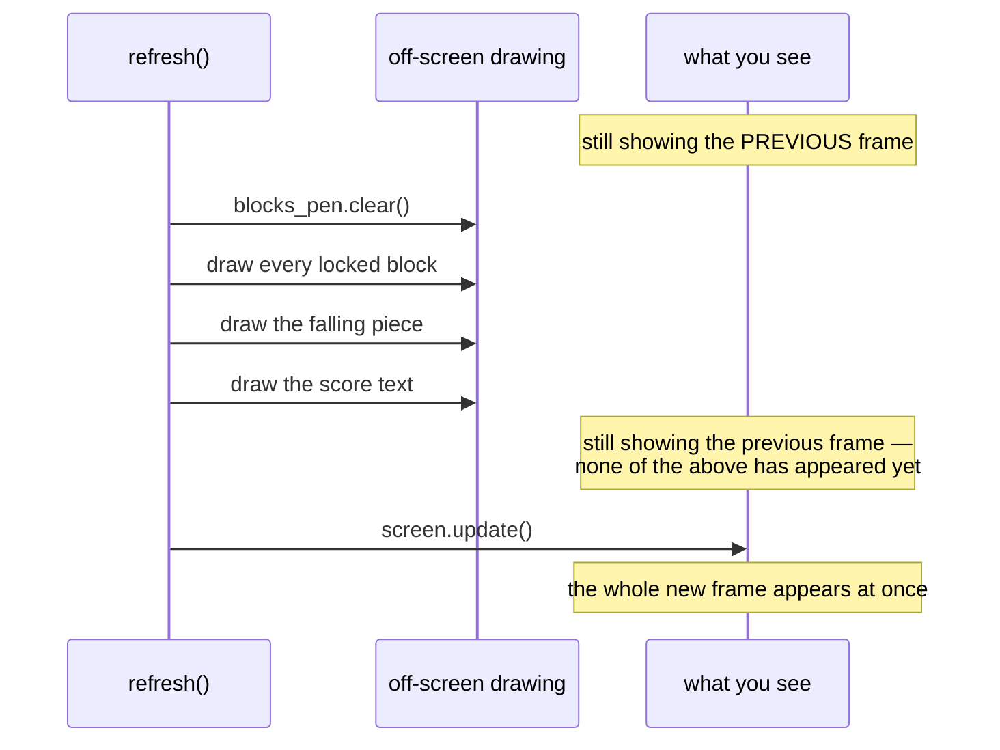
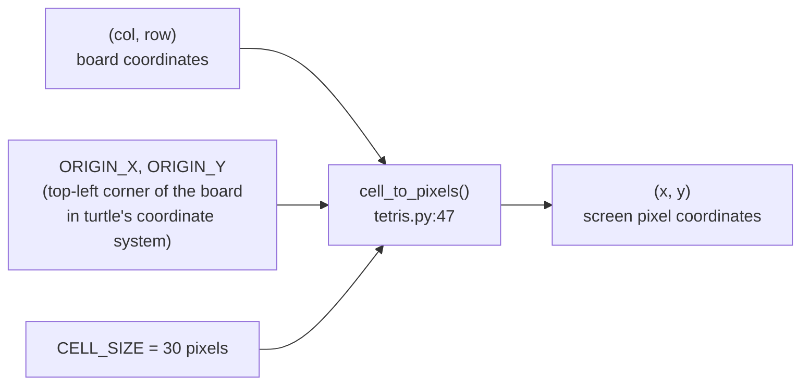
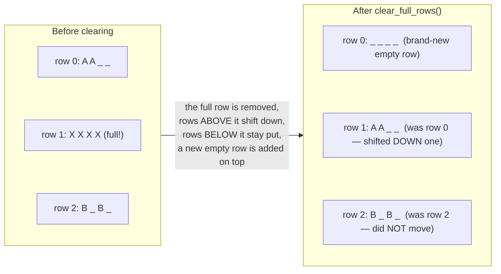
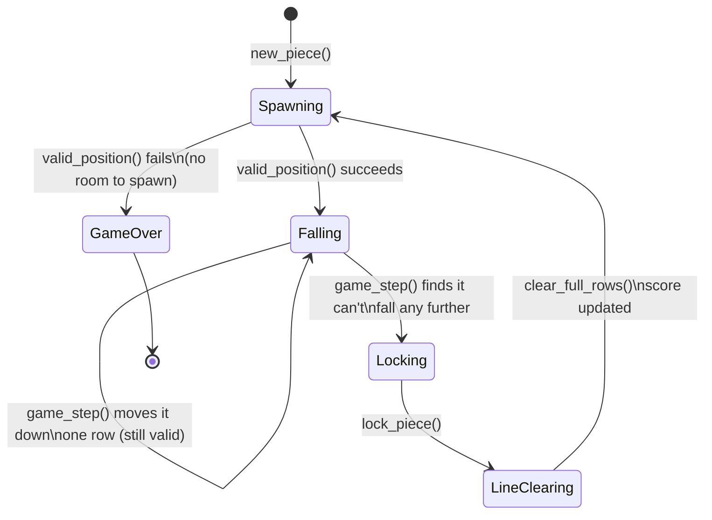
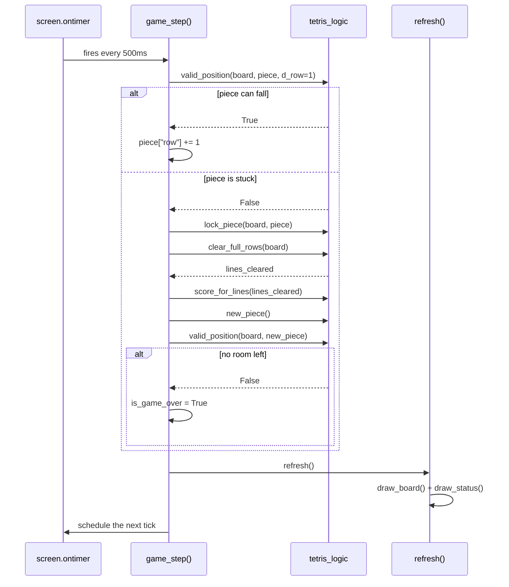
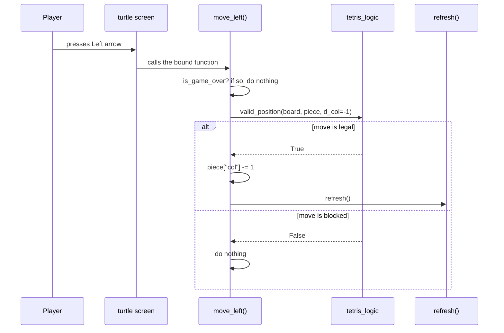

# Turtle Tetris — Design Spec

This document explains **how** and **why** Turtle Tetris is built the way
it is. Read [`README.md`](./README.md) first if you just want to run the
game — come here when you want to understand the design well enough to
extend it yourself.

Every diagram below is [Mermaid](https://mermaid.js.org/) — GitHub, most
IDEs, and the Mermaid Live Editor (<https://mermaid.live>) will render it
as a picture automatically.

---

## 1. Learning goals

This project exists to give you real (not toy) practice with six core
Python building blocks, inside a program small enough to hold in your
head:

| Concept | Where it does real work in this project |
|---|---|
| **Strings** | Piece names (`"T"`, `"I"`, ...) and color names (`"cyan"`, `"purple"`, ...) |
| **Tuples** | Every block offset, like `(1, 0)`, is a fixed pair of numbers — a coordinate |
| **Lists** | The board is a list of rows; each rotation state is a list of tuples |
| **Dictionaries** | `SHAPES`, `COLORS`, and each `piece` itself are all dictionaries |
| **Loops** | Scanning the whole board, drawing every square, checking every block of a piece |
| **Conditionals** | "Did it hit a wall?", "Is this row full?", "Is the game over?" |

Section 10 below (the concept map) gives exact file/line references.

---

## 2. File layout

```
turtle_tetris/
├── tetris_logic.py       # Pure game rules — no drawing, no window, no keyboard
├── tetris.py             # Turtle window, drawing, keyboard handling
├── test_tetris_logic.py  # Automated tests for tetris_logic.py
├── README.md             # Quickstart, controls, concept index
├── SPEC.md               # This file
└── docs/screenshot.png   # The gameplay image used by the README
```

The most important design decision in the whole project is drawn below:
**game rules and game rendering are two separate files.**


**Why split it this way?** `tetris_logic.py` never opens a window, so it
can be tested in a fraction of a second with plain `python3 -m unittest`
— no clicking, no waiting for animations. `tetris.py` trusts that logic
completely and only asks two kinds of questions: *"what should I draw?"*
and *"is this move allowed?"*.

---

## 3. The board: a list of lists

The board is the simplest possible way to represent a grid in Python: a
**list** of rows, where each row is itself a **list** of cells.



* An empty cell holds `None`.
* A filled cell holds a color **string**, e.g. `"cyan"`.
* `board[row][col]` — row first, then column — matches how you'd read
  a grid on paper, top row first, left-to-right within each row.

`new_board()` (`tetris_logic.py:115`) builds this with a **nested loop**:
an outer loop makes each row, and a list comprehension (a compact loop)
fills that row with `COLS` copies of `None`.

> **Beginner trap this code avoids:** writing `[[None] * COLS] * ROWS`
> looks like it makes a fresh grid, but it actually repeats the *same*
> inner list 16 times — change one cell and *every* row changes with it!
> `new_board()` builds each row separately in a loop specifically to
> avoid this. `NewBoardTests.test_rows_are_independent_lists` in the test
> file exists to catch this exact bug if it's ever reintroduced.

---

## 4. Tetromino shapes: dictionaries of lists of tuples

`SHAPES` (`tetris_logic.py:67`) is the data at the heart of the whole
game. It's a **dictionary**: the key is the piece's name (a **string**,
like `"T"`), and the value is a **list** of "rotation states". Each
rotation state is itself a **list** of `(column, row)` **tuples** — the
four squares that make up the piece, measured inside an imaginary 4×4
box.



Rotating a piece is then almost embarrassingly simple: **move to the
next list in the list**, wrapping back to the start with the modulo
operator (`%`). You can see this exact idea in two places:

* `piece_blocks()` (`tetris_logic.py:163`) — `states[rotation % len(states)]`
* `rotate_piece()` (`tetris.py:248`) — `(current_piece["rotation"] + 1) % len(states)`

`COLORS` (`tetris_logic.py:104`) is a second, much simpler dictionary that
just maps each piece name to the color **string** used to draw it.

---

## 5. The piece: a dictionary with a labeled shape

A falling piece is a plain **dictionary** with four keys — see
`new_piece()` at `tetris_logic.py:138`:

```python
piece = {
    "name": "T",       # a string — which shape
    "rotation": 0,      # an int — which entry in SHAPES["T"]
    "col": 4,           # an int — anchor column on the board
    "row": 0,           # an int — anchor row on the board
}
```

We deliberately use a dictionary here instead of a custom class. A class
would hide the same four values behind `.name`, `.rotation`, etc., which
*looks* fancier but doesn't teach anything a beginner doesn't already
know how to do with `piece["name"]`.

### What `class Piece(TypedDict)` is (and isn't)

At the top of `tetris_logic.py:38` you'll find this:

```python
class Piece(TypedDict):
    name: str
    rotation: int
    col: int
    row: int
```

Don't let the `class` keyword fool you — **this does not create a new
kind of object.** A piece is still an ordinary dictionary at runtime; you
still build it with `{...}` and read it with `piece["col"]`. `TypedDict`
only *describes* the dictionary's shape, which buys you two things:

* your editor autocompletes the four key names, and underlines typos
  like `piece["collumn"]` before you ever run the program;
* tools like `mypy` can prove that `piece["col"] - 1` is valid maths
  (because `col` is an `int`) — see the "Type checking" note in the
  README.

Prove it to yourself: `print(type(piece))` anywhere in the code prints
`<class 'dict'>`, not `Piece`.

Once you're comfortable with dictionaries, rewriting `Piece` as a real
`@dataclass` — with actual `piece.col` attributes — is a great stretch
exercise (see the README).

To find where a piece's actual blocks sit **on the board**, every
function does the same one-line calculation, for every `(dc, dr)` offset
in `piece_blocks(piece)`:

```python
col = piece["col"] + dc
row = piece["row"] + dr
```

---

## 6. How turtle graphics actually works

Everything you see on screen is drawn by Python's built-in `turtle`
module. It's worth understanding on its own, because nothing about it is
specific to Tetris — the same handful of ideas draw anything.

### 6.1 A turtle is a pen you give directions to

Picture a robot turtle sitting on a giant sheet of paper, holding a pen.
You never tell it "draw a square at position (50, 80)". You tell it how
to *walk*, and the pen leaves a trail behind it:

```python
pen.forward(30)   # walk 30 pixels in the direction you're facing
pen.right(90)     # turn 90 degrees clockwise (on the spot)
```

Do those two things four times and you've walked in a complete circuit —
a square. That's literally how `draw_square()` in `tetris.py:89` works:



Because every side repeats the same two commands, the code is a **loop**
that runs four times — not eight separate lines:

```python
for _ in range(4):      # [LOOP]
    pen.forward(CELL_SIZE)
    pen.right(90)
```

**Lifting the pen.** A turtle draws whenever it moves, which is a problem
when you just want to *reposition* it. So the pen can be lifted:

* `pen.penup()` — lift the pen; movement leaves no trail.
* `pen.goto(x, y)` — jump straight to a position.
* `pen.pendown()` — put the pen back down; movement draws again.

That's why `draw_square()` starts with `goto()` while the pen is up, then
puts the pen down only once it's in the right place.

**Filling with color.** An outline isn't enough — Tetris blocks are solid.
So the square-drawing loop is wrapped in a fill:

```python
pen.fillcolor("cyan")
pen.begin_fill()
...draw the four sides...
pen.end_fill()      # everything enclosed since begin_fill() is now filled in
```

### 6.2 Turtle's coordinate system

Turtle puts `(0, 0)` at the **center** of the window, with `x` growing
right and `y` growing **up** — like graph paper in maths class, not like
a computer screen:



Our board, meanwhile, counts rows from the top downwards (row 0 is the
top row). Those two disagree about which way is "down", which is exactly
why the conversion in the next section *subtracts* for `y`.

### 6.3 Three turtles, used as three layers

You can have as many turtles as you like, and each one remembers only
what it personally drew. `pen.clear()` erases that turtle's own drawing
and nothing else. This project uses that as a layering trick:

| Turtle | Draws | Redrawn? |
|---|---|---|
| `board_pen` | the white board border | Once, at startup — it never changes |
| `blocks_pen` | every locked block and the falling piece | Cleared and redrawn every frame |
| `text_pen` | the score / game-over line | Cleared and rewritten when the score changes |

If a single turtle drew all three, clearing the blocks each frame would
wipe out the border and the score too, and they'd have to be redrawn
constantly. Separate turtles keep each layer independent.

### 6.4 Why the screen doesn't flicker: `tracer(0)` and `update()`

By default, turtle *animates* — you'd watch the pen crawl around every
single block, four sides at a time. With up to 160 blocks per frame, the
game would be unwatchably slow and would visibly flicker as it erased and
redrew.

The fix is two lines:

* `screen.tracer(0)` — at startup, switches off automatic redrawing.
  Drawing commands now happen invisibly, off-screen.
* `screen.update()` — after a frame is fully drawn, show all of it at
  once.



Showing only finished frames is a standard game-programming technique
called **double buffering**. It's the difference between watching someone
paint and being handed the finished painting.

### 6.5 The game loop is made of timers, not a `while` loop

A beginner's instinct for a game loop is:

```python
while True:          # DON'T do this with turtle
    move_piece_down()
    time.sleep(0.5)
```

That freezes the window. Turtle needs to be free to notice key presses
and repaint the window, and a `while True` loop never gives it the chance,
so the window stops responding entirely.

Instead, you hand turtle a function and ask it to call you back later:

```python
screen.ontimer(game_step, 500)   # "run game_step() in 500 milliseconds"
```

The trick is that `game_step()` ends by scheduling *itself* again. Each
call sets up the next one, so the piece keeps falling forever without any
loop at all — see `game_step()` at `tetris.py:278`.

### 6.6 Keyboard input

Three pieces have to line up for a key press to reach your code:

```python
screen.listen()                    # give the window keyboard focus
screen.onkey(move_left, "Left")    # when Left is pressed, call move_left()
screen.mainloop()                  # hand control to turtle: watch for
                                    # key presses and timers, forever
```

Note that you pass `move_left` **without** parentheses. `move_left()`
with parentheses would call the function immediately and hand turtle its
return value; `move_left` without them hands over the function itself, to
be called later. Mixing these up is one of the most common beginner bugs
in event-driven code.

Turtle's key names are strings: `"Left"`, `"Right"`, `"Up"`, `"Down"`
(capitalized) and `"space"` (lowercase).

`mainloop()` is the last line of the program and never returns — from
that point on, everything that happens is turtle calling one of your
functions, either because a key was pressed or because a timer expired.

---

## 7. From board cells to screen pixels

`tetris_logic.py` only ever talks about columns and rows (`0..9`,
`0..15`). `tetris.py` is the only file that knows about pixels, and the
translation happens in exactly one function:



```python
x = ORIGIN_X + col * CELL_SIZE
y = ORIGIN_Y - row * CELL_SIZE     # subtract, because row grows DOWN
                                     # but turtle's y-axis grows UP
```

Keeping this conversion in one small function means the rest of the
drawing code (`draw_board()`, `draw_square()`) never has to think about
pixels at all — it just says "put a `cyan` square at column 3, row 7."

---

## 8. Core algorithm walkthroughs

### 8.1 `valid_position()` — can a piece go here?

Every move in the game — sliding, dropping, rotating — asks this same
question first. It's a loop over the piece's four blocks, with three
possible reasons to say "no":


This one function, `valid_position()` (`tetris_logic.py:186`), is reused
for *every* kind of check by passing different arguments:

| Question asked | Call |
|---|---|
| Can it move left? | `valid_position(board, piece, d_col=-1)` |
| Can it move right? | `valid_position(board, piece, d_col=1)` |
| Can it fall one row? | `valid_position(board, piece, d_row=1)` |
| Can it rotate? | `valid_position(board, piece, rotation=next_rotation)` |
| Is the new piece stuck at spawn (game over)? | `valid_position(board, piece)` |

### 8.2 `clear_full_rows()` — finishing a line



The implementation (`tetris_logic.py:254`) is two loops:

1. A `for` loop walks every row; any row **without** a `None` in it
   (checked with the `in` operator) is "full" and gets left out of the
   kept rows.
2. A `while` loop then inserts brand-new empty rows at the *front* of
   the list until the board is back up to `ROWS` rows again — this is
   what makes everything above a cleared line appear to "fall" down.

### 8.3 The full turn of one falling piece



---

## 9. Two sequence diagrams

### 9.1 An automatic tick (the piece falls on its own)



### 9.2 A key press (e.g. the player taps the Left arrow)



Notice both diagrams lean on the *exact same* `valid_position()`
function — that reuse is the whole reason the game logic fits in one
small file.

---

## 10. Concept map (with file:line references)

Line numbers are accurate as of this writing; if you edit the files,
search for the function name instead of trusting the number forever.

| Concept | Example | Location |
|---|---|---|
| **String** | `"T"`, `"cyan"` | `SHAPES`/`COLORS` keys and values, `tetris_logic.py:67`, `:104` |
| **Tuple** | `(1, 0)` — a block offset | Every entry inside `SHAPES`, `tetris_logic.py:67` |
| **List** | `board[row]` — one row of cells | `new_board()`, `tetris_logic.py:115` |
| **List of lists** | `board` itself (a grid) | `new_board()`, `tetris_logic.py:115` |
| **List of lists of tuples** | `SHAPES["T"]` (4 rotation states) | `tetris_logic.py:67` |
| **Dictionary** | `piece = {"name": ..., "rotation": ...}` | `new_piece()`, `tetris_logic.py:138` |
| **Dictionary** | `SHAPES`, `COLORS` | `tetris_logic.py:67`, `:104` |
| **for loop** | scanning every board cell | `draw_board()`, `tetris.py:129` |
| **for loop** | checking every block of a piece | `valid_position()`, `tetris_logic.py:186` |
| **while loop** | refilling empty rows after a clear | `clear_full_rows()`, `tetris_logic.py:254` |
| **if / elif / else** | wall / floor / collision checks | `valid_position()`, `tetris_logic.py:186` |
| **if / else** | "is the row full?" | `clear_full_rows()`, `tetris_logic.py:254` |
| **if / else** | "did the game just end?" | `spawn_next_piece()`, `tetris.py:199` |

---

## 11. Where to go next

The [README](./README.md) has a "Stretch goals" section with concrete
next features (ghost piece, next-piece preview, wall kicks, a high-score
file) — each one is a good excuse to practice one of the concepts above
a little further.
