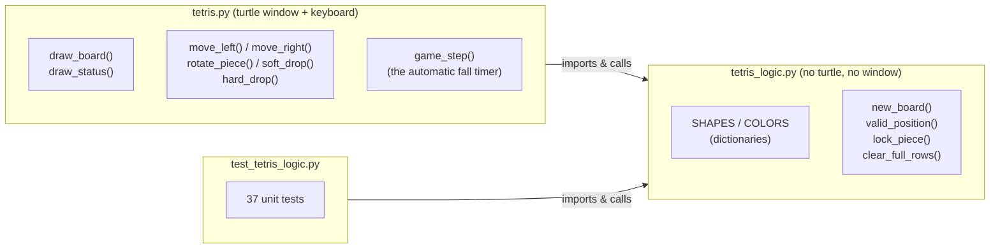
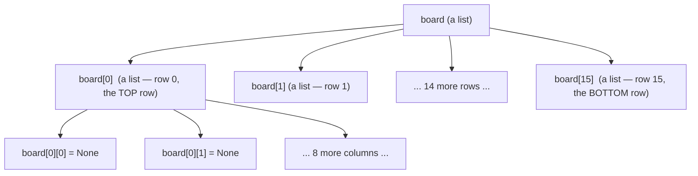
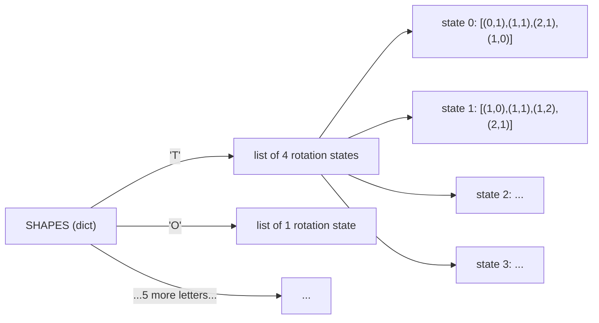
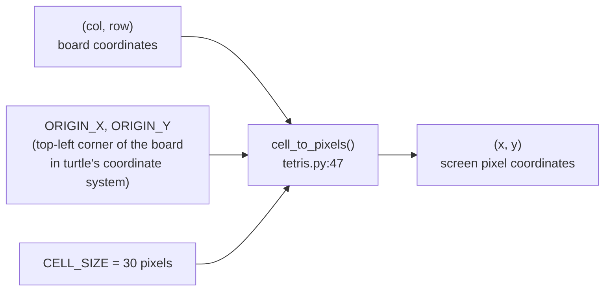
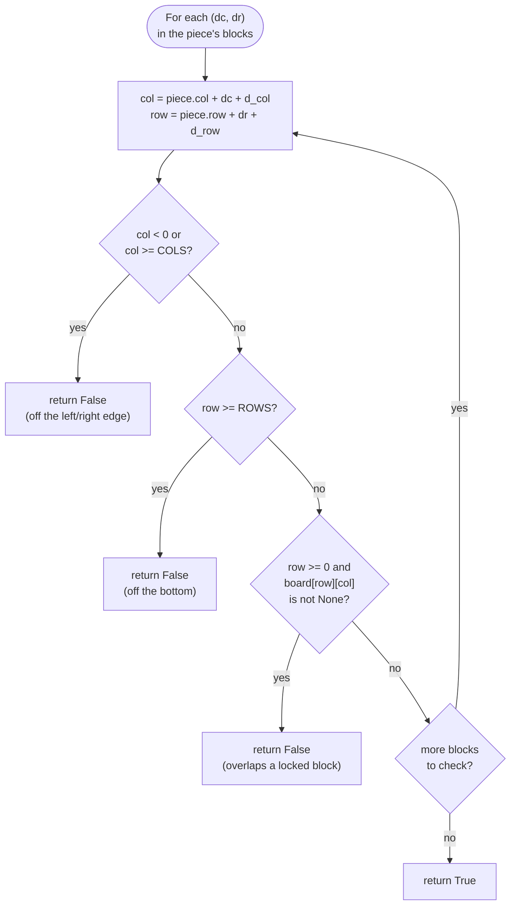
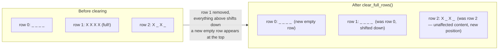
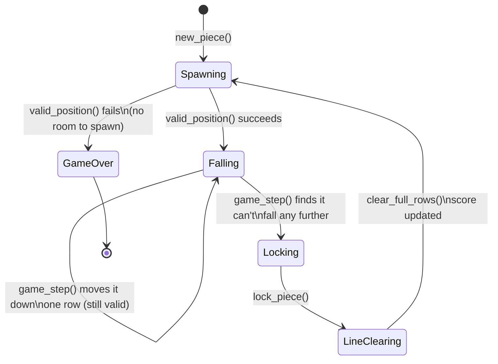
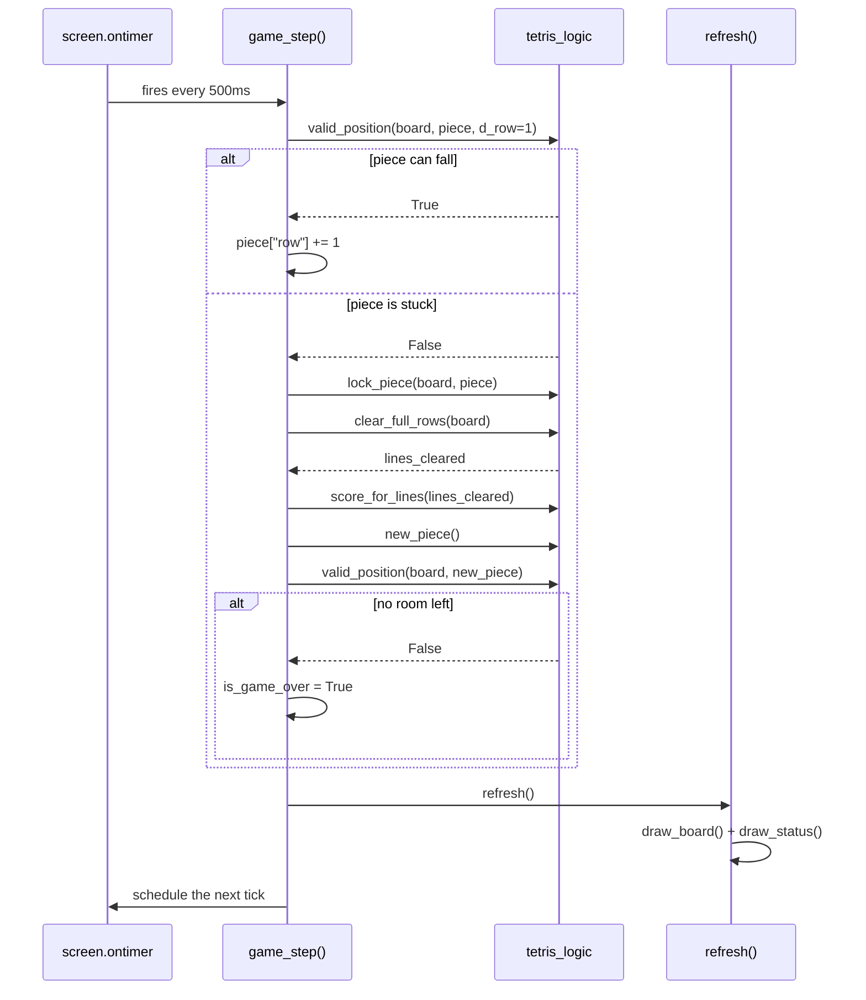
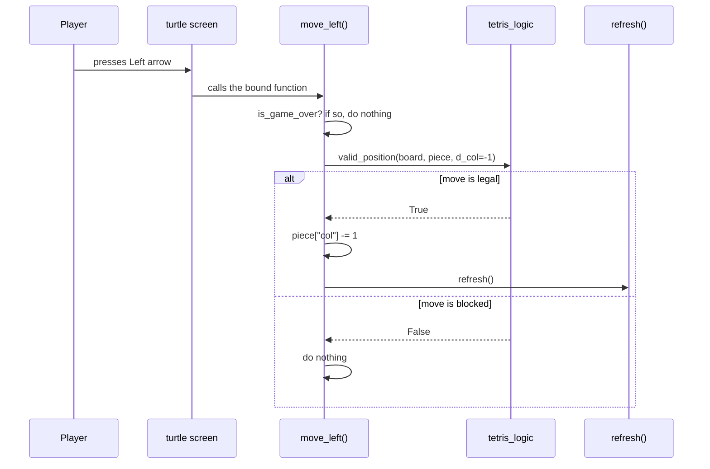

# Turtle Tetris — Design Spec

This document explains **how** and **why** Turtle Tetris is built the way
it is. Read [`README.md`](./README.md) first if you just want to run the
game — come here when you want to understand the design well enough to
extend it yourself.

Every diagram below is [Mermaid](https://mermaid.js.org/) — GitHub, most
IDEs, and the Mermaid Live Editor (<https://mermaid.live>) will render it
as a picture automatically.

---

## 1. Learning goals

This project exists to give you real (not toy) practice with six core
Python building blocks, inside a program small enough to hold in your
head:

| Concept | Where it does real work in this project |
|---|---|
| **Strings** | Piece names (`"T"`, `"I"`, ...) and color names (`"cyan"`, `"purple"`, ...) |
| **Tuples** | Every block offset, like `(1, 0)`, is a fixed pair of numbers — a coordinate |
| **Lists** | The board is a list of rows; each rotation state is a list of tuples |
| **Dictionaries** | `SHAPES`, `COLORS`, and each `piece` itself are all dictionaries |
| **Loops** | Scanning the whole board, drawing every square, checking every block of a piece |
| **Conditionals** | "Did it hit a wall?", "Is this row full?", "Is the game over?" |

Section 7 below (the concept map) gives exact file/line references.

---

## 2. File layout

```
turtle_tetris/
├── tetris_logic.py      # Pure game rules — no drawing, no window, no keyboard
├── tetris.py             # Turtle window, drawing, keyboard handling
├── test_tetris_logic.py  # Automated tests for tetris_logic.py
├── README.md              # Quickstart, controls, concept index
└── SPEC.md                # This file
```

The most important design decision in the whole project is drawn below:
**game rules and game rendering are two separate files.**



**Why split it this way?** `tetris_logic.py` never opens a window, so it
can be tested in a fraction of a second with plain `python3 -m unittest`
— no clicking, no waiting for animations. `tetris.py` trusts that logic
completely and only asks two kinds of questions: *"what should I draw?"*
and *"is this move allowed?"*.

---

## 3. The board: a list of lists

The board is the simplest possible way to represent a grid in Python: a
**list** of rows, where each row is itself a **list** of cells.



* An empty cell holds `None`.
* A filled cell holds a color **string**, e.g. `"cyan"`.
* `board[row][col]` — row first, then column — matches how you'd read
  a grid on paper, top row first, left-to-right within each row.

`new_board()` (`tetris_logic.py:94`) builds this with a **nested loop**:
an outer loop makes each row, and a list comprehension (a compact loop)
fills that row with `COLS` copies of `None`.

> **Beginner trap this code avoids:** writing `[[None] * COLS] * ROWS`
> looks like it makes a fresh grid, but it actually repeats the *same*
> inner list 16 times — change one cell and *every* row changes with it!
> `new_board()` builds each row separately in a loop specifically to
> avoid this. `NewBoardTests.test_rows_are_independent_lists` in the test
> file exists to catch this exact bug if it's ever reintroduced.

---

## 4. Tetromino shapes: dictionaries of lists of tuples

`SHAPES` (`tetris_logic.py:46`) is the data at the heart of the whole
game. It's a **dictionary**: the key is the piece's name (a **string**,
like `"T"`), and the value is a **list** of "rotation states". Each
rotation state is itself a **list** of `(column, row)` **tuples** — the
four squares that make up the piece, measured inside an imaginary 4×4
box.



Rotating a piece is then almost embarrassingly simple: **move to the
next list in the list**, wrapping back to the start with the modulo
operator (`%`). You can see this exact idea in two places:

* `piece_blocks()` (`tetris_logic.py:145`) — `states[rotation % len(states)]`
* `rotate_piece()` (`tetris.py:248`) — `(current_piece["rotation"] + 1) % len(states)`

`COLORS` (`tetris_logic.py:83`) is a second, much simpler dictionary that
just maps each piece name to the color **string** used to draw it.

---

## 5. The piece: a dictionary, not a class

A falling piece is a plain **dictionary** with four keys — see
`new_piece()` at `tetris_logic.py:117`:

```python
piece = {
    "name": "T",       # a string — which shape
    "rotation": 0,      # an int — which entry in SHAPES["T"]
    "col": 4,           # an int — anchor column on the board
    "row": 0,           # an int — anchor row on the board
}
```

We deliberately use a dictionary here instead of a custom class. A class
would hide the same four values behind `.name`, `.rotation`, etc., which
*looks* fancier but doesn't teach anything a beginner doesn't already
know how to do with `piece["name"]`. Once you're comfortable with
dictionaries, rewriting `Piece` as a `@dataclass` is a great stretch
exercise (see the README).

To find where a piece's actual blocks sit **on the board**, every
function does the same one-line calculation, for every `(dc, dr)` offset
in `piece_blocks(piece)`:

```python
col = piece["col"] + dc
row = piece["row"] + dr
```

---

## 6. From board cells to screen pixels

`tetris_logic.py` only ever talks about columns and rows (`0..9`,
`0..15`). `tetris.py` is the only file that knows about pixels, and the
translation happens in exactly one function:



```python
x = ORIGIN_X + col * CELL_SIZE
y = ORIGIN_Y - row * CELL_SIZE     # subtract, because row grows DOWN
                                     # but turtle's y-axis grows UP
```

Keeping this conversion in one small function means the rest of the
drawing code (`draw_board()`, `draw_square()`) never has to think about
pixels at all — it just says "put a `cyan` square at column 3, row 7."

---

## 7. Core algorithm walkthroughs

### 7.1 `valid_position()` — can a piece go here?

Every move in the game — sliding, dropping, rotating — asks this same
question first. It's a loop over the piece's four blocks, with three
possible reasons to say "no":



This one function, `valid_position()` (`tetris_logic.py:168`), is reused
for *every* kind of check by passing different arguments:

| Question asked | Call |
|---|---|
| Can it move left? | `valid_position(board, piece, d_col=-1)` |
| Can it move right? | `valid_position(board, piece, d_col=1)` |
| Can it fall one row? | `valid_position(board, piece, d_row=1)` |
| Can it rotate? | `valid_position(board, piece, rotation=next_rotation)` |
| Is the new piece stuck at spawn (game over)? | `valid_position(board, piece)` |

### 7.2 `clear_full_rows()` — finishing a line



The implementation (`tetris_logic.py:236`) is two loops:

1. A `for` loop walks every row; any row **without** a `None` in it
   (checked with the `in` operator) is "full" and gets left out of the
   kept rows.
2. A `while` loop then inserts brand-new empty rows at the *front* of
   the list until the board is back up to `ROWS` rows again — this is
   what makes everything above a cleared line appear to "fall" down.

### 7.3 The full turn of one falling piece



---

## 8. Two sequence diagrams

### 8.1 An automatic tick (the piece falls on its own)



### 8.2 A key press (e.g. the player taps the Left arrow)



Notice both diagrams lean on the *exact same* `valid_position()`
function — that reuse is the whole reason the game logic fits in one
small file.

---

## 9. Concept map (with file:line references)

Line numbers are accurate as of this writing; if you edit the files,
search for the function name instead of trusting the number forever.

| Concept | Example | Location |
|---|---|---|
| **String** | `"T"`, `"cyan"` | `SHAPES`/`COLORS` keys and values, `tetris_logic.py:46`, `:83` |
| **Tuple** | `(1, 0)` — a block offset | Every entry inside `SHAPES`, `tetris_logic.py:46` |
| **List** | `board[row]` — one row of cells | `new_board()`, `tetris_logic.py:94` |
| **List of lists** | `board` itself (a grid) | `new_board()`, `tetris_logic.py:94` |
| **List of lists of tuples** | `SHAPES["T"]` (4 rotation states) | `tetris_logic.py:46` |
| **Dictionary** | `piece = {"name": ..., "rotation": ...}` | `new_piece()`, `tetris_logic.py:117` |
| **Dictionary** | `SHAPES`, `COLORS` | `tetris_logic.py:46`, `:83` |
| **for loop** | scanning every board cell | `draw_board()`, `tetris.py:129` |
| **for loop** | checking every block of a piece | `valid_position()`, `tetris_logic.py:168` |
| **while loop** | refilling empty rows after a clear | `clear_full_rows()`, `tetris_logic.py:236` |
| **if / elif / else** | wall / floor / collision checks | `valid_position()`, `tetris_logic.py:168` |
| **if / else** | "is the row full?" | `clear_full_rows()`, `tetris_logic.py:236` |
| **if / else** | "did the game just end?" | `spawn_next_piece()`, `tetris.py:199` |

---

## 10. Where to go next

The [README](./README.md) has a "Stretch goals" section with concrete
next features (ghost piece, next-piece preview, wall kicks, a high-score
file) — each one is a good excuse to practice one of the concepts above
a little further.
